# Лабораторная работа №1

## Тема: Передискретизация, обесцвечивание и бинаризация растровых изображений

### Студент: Камолов Амир

### Группа: Б18-514

### 1. Передискретизация

Исходное изображение размером `720x458` :

Исходное изображение размером `720x720` :

#### 1.1 Растяжение (интерполяция) изображения в M раз

Интерполяция в 2 раза. Исходный размер `720x458` результирующий размер `1440x916`:

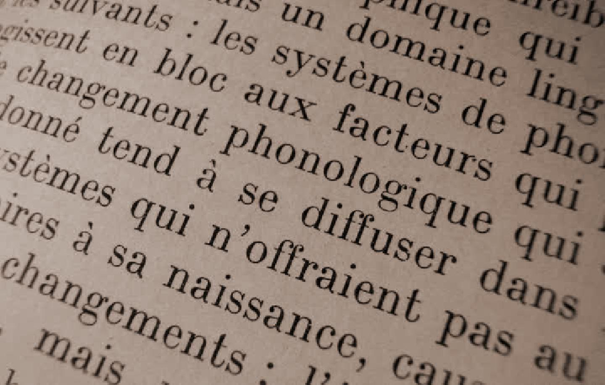

Интерполяция в 3 раза. Исходный размер `720x458` результирующий размер `2160x1374`:

---

Интерполяция в 2 раза. Исходный размер `720x720` результирующий размер `1440x1440`:

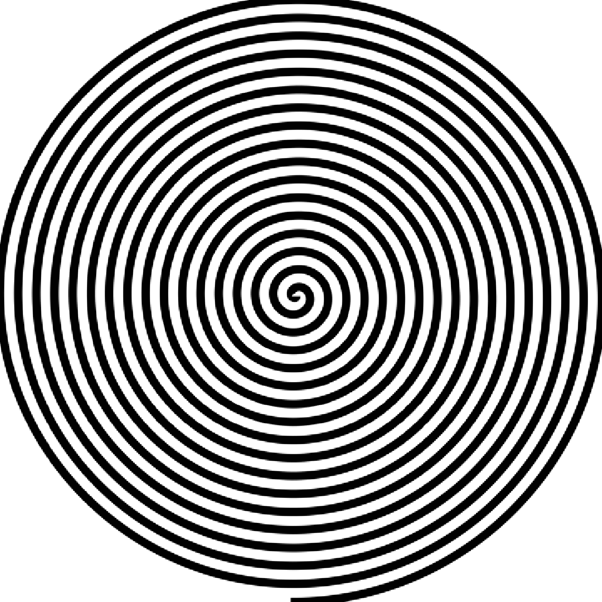

Интерполяция в 3 раза. Исходный размер `720x720` результирующий размер `2160x2160`:

#### 1.2 Сжатие (децимация) изображения в N раз

Децимация в 2 раза. Исходный размер `720x458` результирующий размер `360x229`:

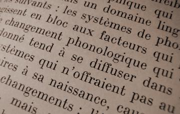

Децимация в 3 раза. Исходный размер `720x458` результирующий размер `240x153`:

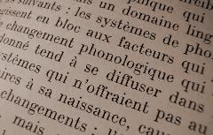

---

Децимация в 2 раза. Исходный размер `720x720` результирующий размер `360x360`:

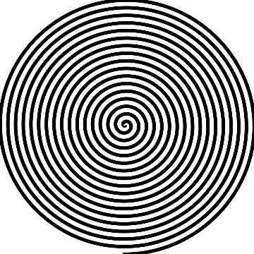

Децимация в 3 раза. Исходный размер `720x720` результирующий размер `240x240`:

#### 1.3 Передискретизация изображения в K=M/N раз путём растяжения и последующего сжатия (в два прохода)

Передискретизация изображения в K=3/2 раз за два прохода. Исходный размер `720x458` результирующий размер `1080x687`:

---

Передискретизация изображения в K=3/2 раз за два прохода. Исходный размер `720x720` результирующий размер `1080x1080`:

#### 1.4 Передискретизация изображения в K раз за один проход

Передискретизация изображения в K=3/2 раз за один проход. Исходный размер `720x458` результирующий размер `1080x687`:

---

Передискретизация изображения в K=3/2 раз за один проход. Исходный размер `720x720` результирующий размер `1080x1080`:

### 2. Приведение полноцветного изображения к полутоновому

Исходное изображение:

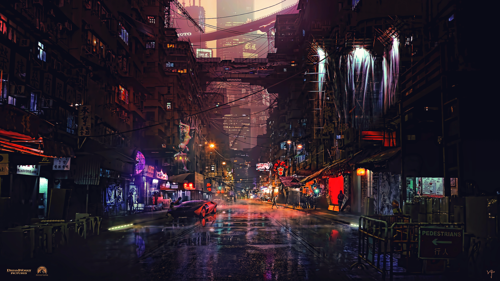

Результирующее изображение с обычными коэффицентами:

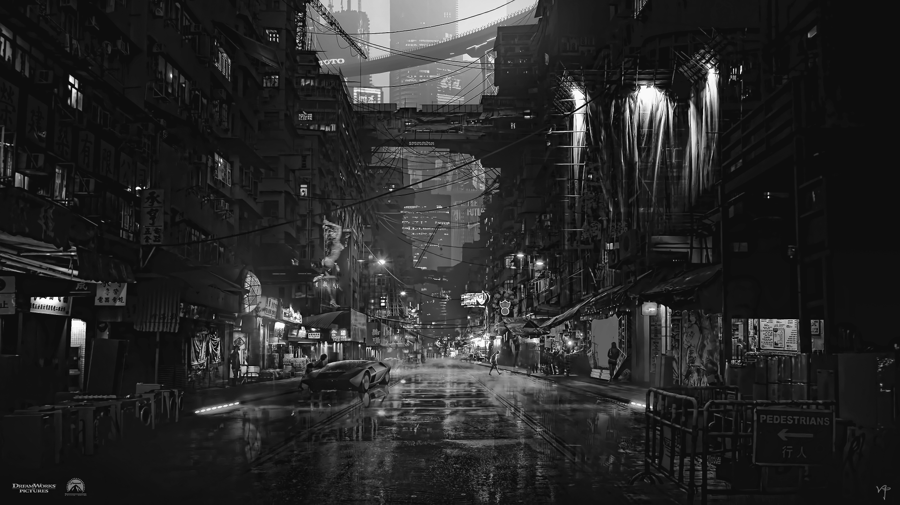

Результирующее изображение с коэффицентами photoshop:

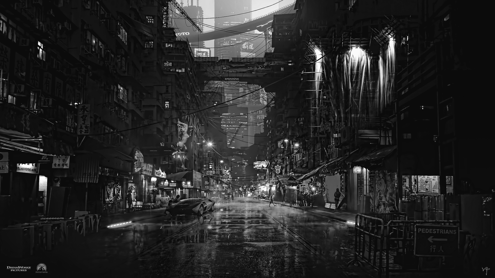

---

Исходное изображение:

Результирующее изображение с обычными коэффицентами:

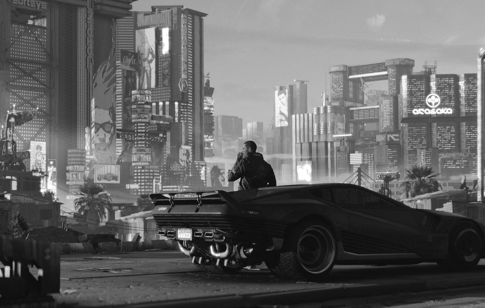

Результирующее изображение с коэффицентами photoshop:

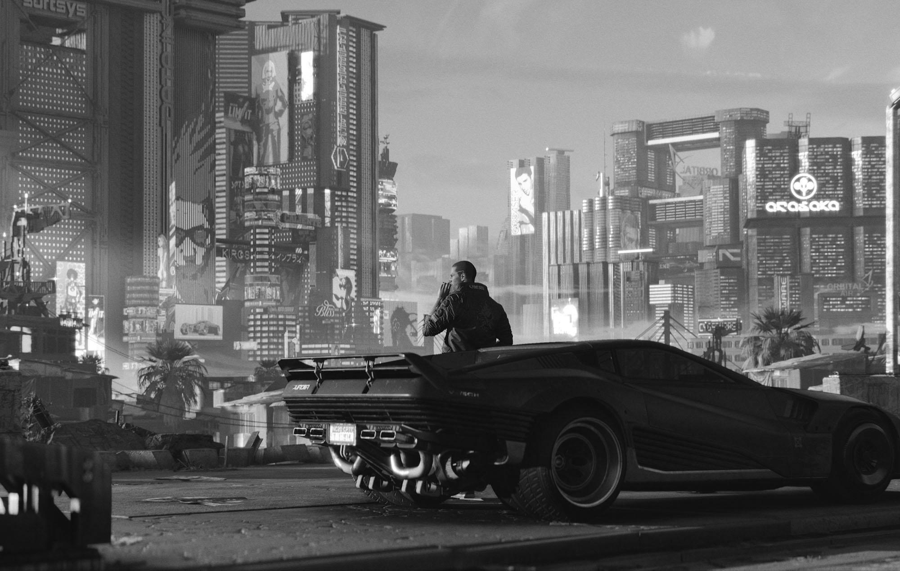

### 3. Приведение полутонового изображения к монохромному методом пороговой обработки

> Алгоритм адаптивной бинаризации Кристиана

Исходное изображение:

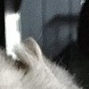

Результирующее изображение c `k = 0.2`, `b = 15`:

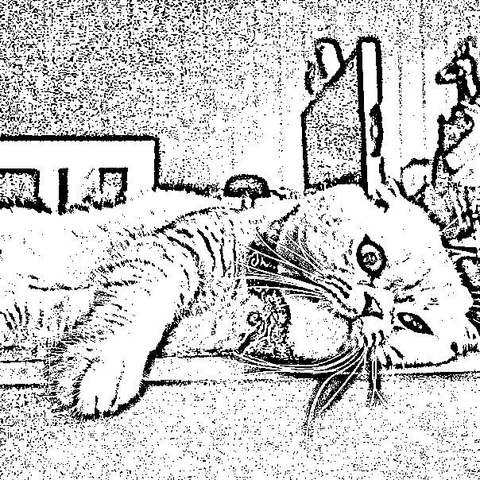

Результирующее изображение c `k = 0.5`, `b = 10`:

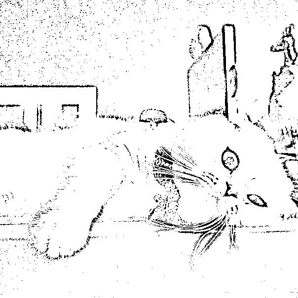

---

Исходное изображение:

Результирующее изображение c `k = 0.2`, `b = 15`:

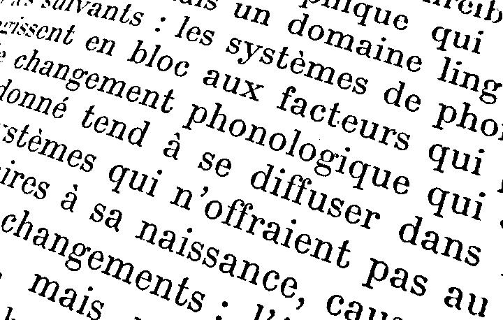

Результирующее изображение c `k = 0.5`, `b = 10`:

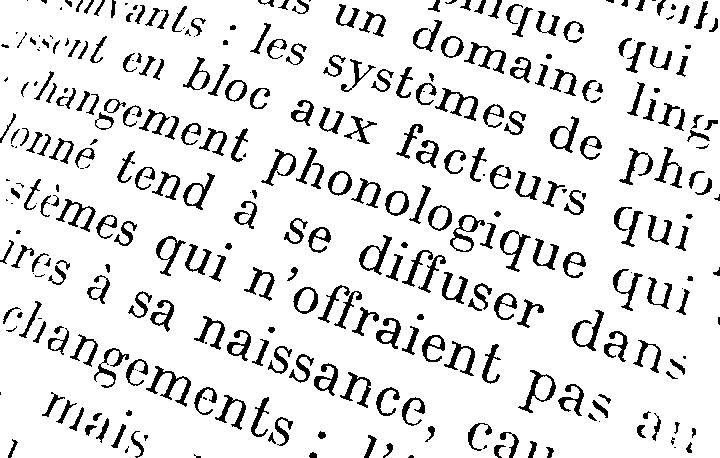
