# Лабораторная работа №4

## Тема: Выделение признаков символов

|**Студент:**|*Камолов Амир*|
|------------|--------------|
|**Группа:** |*Б18-514*     |
|**Вариант:**|*Армянский алфавит*|

### Буква Ա
|Символ|Профиль по х|Профиль по y|
|---------------------|--------------------------|--------------------------|
|| 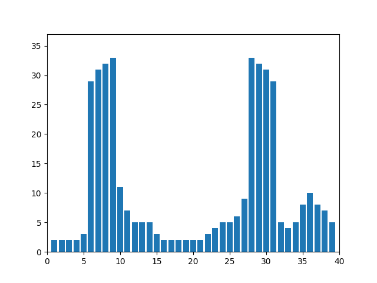| 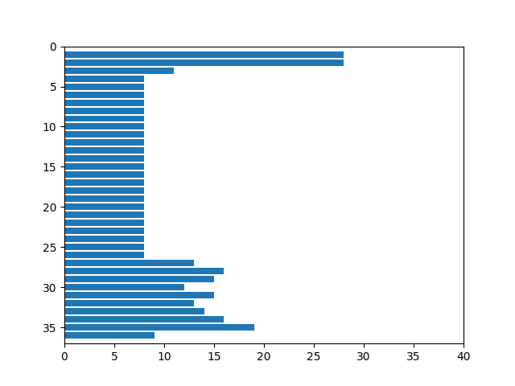|

|Признак|Значение|
|-------|--------|
|Вес чёрного|393|
|Нормированный вес чёрного|0.2799145299145299|
|Центр масс|(19, 18)|
|Нормированный центр масс|(0.47368421052631576, 0.4857142857142857)|
|Моменты инерции|(54266, 50552)|
|Нормированные моменты инерции|(19.2637557685481, 17.945331913383033)|

### Буква ա
|Символ|Профиль по х|Профиль по y|
|---------------------|--------------------------|--------------------------|
|| 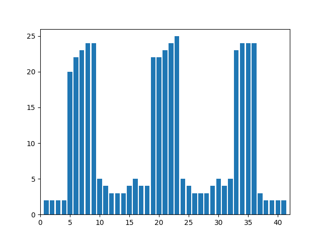| 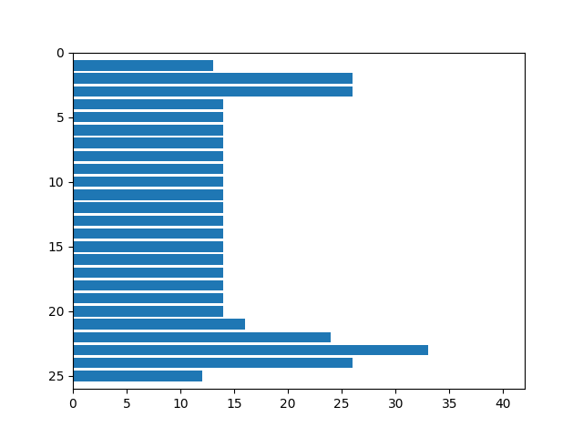|

|Признак|Значение|
|-------|--------|
|Вес чёрного|414|
|Нормированный вес чёрного|0.40390243902439027|
|Центр масс|(19, 12)|
|Нормированный центр масс|(0.45, 0.4583333333333333)|
|Моменты инерции|(24710, 50097)|
|Нормированные моменты инерции|(10.715524718126627, 21.724631396357328)|

### Буква Բ
|Символ|Профиль по х|Профиль по y|
|---------------------|--------------------------|--------------------------|
|| 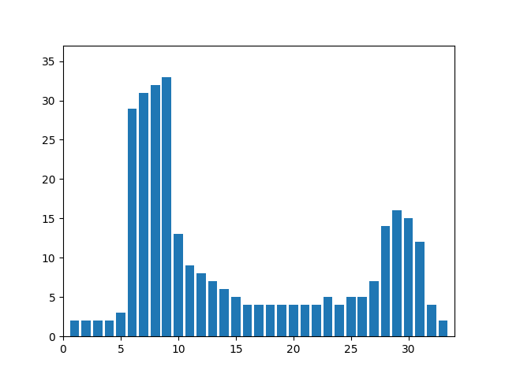| 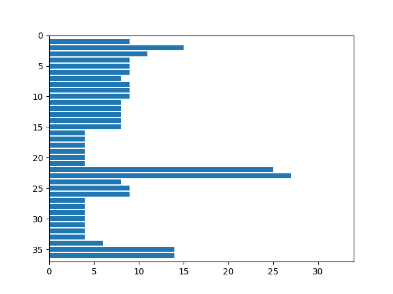|

|Признак|Значение|
|-------|--------|
|Вес чёрного|301|
|Нормированный вес чёрного|0.25336700336700335|
|Центр масс|(14, 17)|
|Нормированный центр масс|(0.40625, 0.45714285714285713)|
|Моменты инерции|(34468, 26294)|
|Нормированные моменты инерции|(14.451991614255766, 11.024737945492662)|

### Буква բ
|Символ|Профиль по х|Профиль по y|
|---------------------|--------------------------|--------------------------|
|| 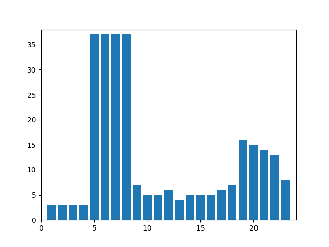| 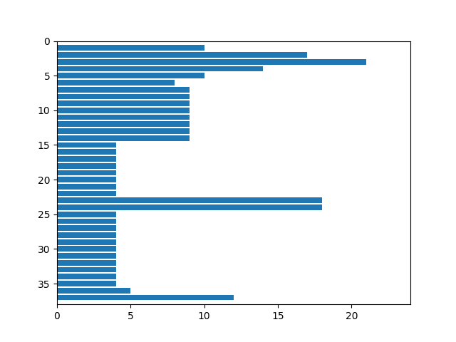|

|Признак|Значение|
|-------|--------|
|Вес чёрного|281|
|Нормированный вес чёрного|0.3301997649823737|
|Центр масс|(10, 15)|
|Нормированный центр масс|(0.4090909090909091, 0.3888888888888889)|
|Моменты инерции|(34471, 11292)|
|Нормированные моменты инерции|(18.161749209694417, 5.949420442571127)|

### Буква Գ
|Символ|Профиль по х|Профиль по y|
|---------------------|--------------------------|--------------------------|
|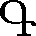| 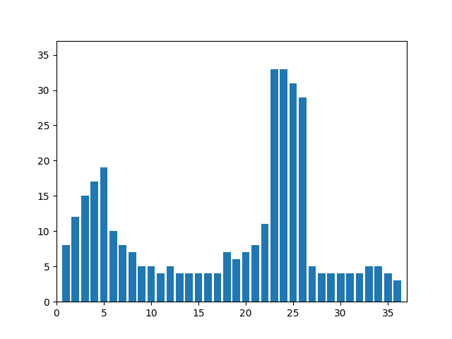| 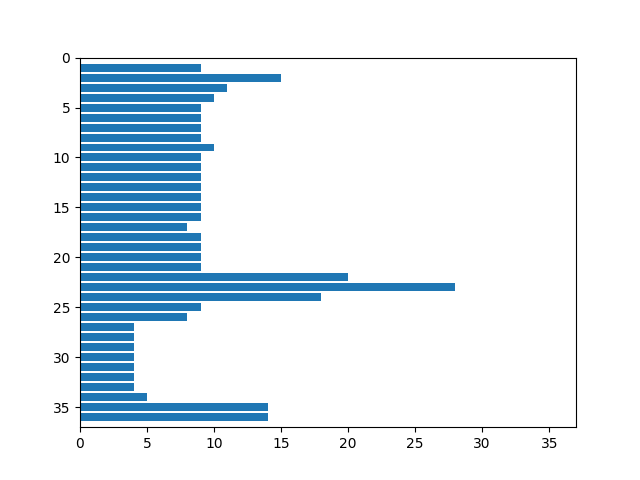|

|Признак|Значение|
|-------|--------|
|Вес чёрного|342|
|Нормированный вес чёрного|0.2638888888888889|
|Центр масс|(17, 17)|
|Нормированный центр масс|(0.45714285714285713, 0.45714285714285713)|
|Моменты инерции|(35080, 33259)|
|Нормированные моменты инерции|(13.533950617283951, 12.831404320987655)|

### Буква գ
|Символ|Профиль по х|Профиль по y|
|---------------------|--------------------------|--------------------------|
|| 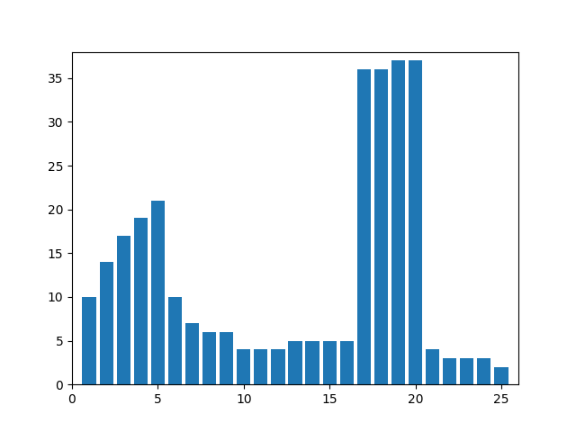| 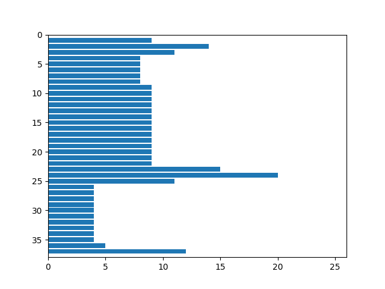|

|Признак|Значение|
|-------|--------|
|Вес чёрного|303|
|Нормированный вес чёрного|0.32756756756756755|
|Центр масс|(12, 16)|
|Нормированный центр масс|(0.4583333333333333, 0.4166666666666667)|
|Моменты инерции|(31310, 14902)|
|Нормированные моменты инерции|(15.70210631895687, 7.473420260782347)|

### Буква Դ
|Символ|Профиль по х|Профиль по y|
|---------------------|--------------------------|--------------------------|
|| 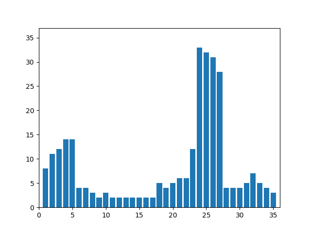| 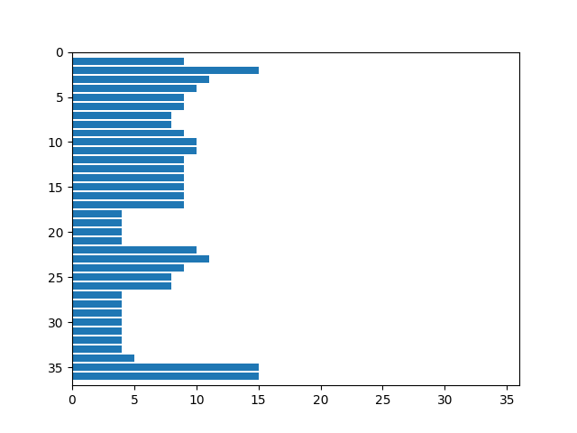|

|Признак|Значение|
|-------|--------|
|Вес чёрного|287|
|Нормированный вес чёрного|0.22777777777777777|
|Центр масс|(19, 16)|
|Нормированный центр масс|(0.5294117647058824, 0.42857142857142855)|
|Моменты инерции|(34210, 28523)|
|Нормированные моменты инерции|(13.570011900039667, 11.314161047203491)|

### Буква դ
|Символ|Профиль по х|Профиль по y|
|---------------------|--------------------------|--------------------------|
|| 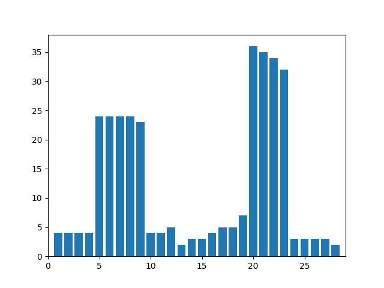| |

|Признак|Значение|
|-------|--------|
|Вес чёрного|328|
|Нормированный вес чёрного|0.3166023166023166|
|Центр масс|(14, 15)|
|Нормированный центр масс|(0.48148148148148145, 0.3888888888888889)|
|Моменты инерции|(35145, 18355)|
|Нормированные моменты инерции|(16.323734324198792, 8.525313516024152)|

### Буква Ե
|Символ|Профиль по х|Профиль по y|
|---------------------|--------------------------|--------------------------|
|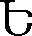| 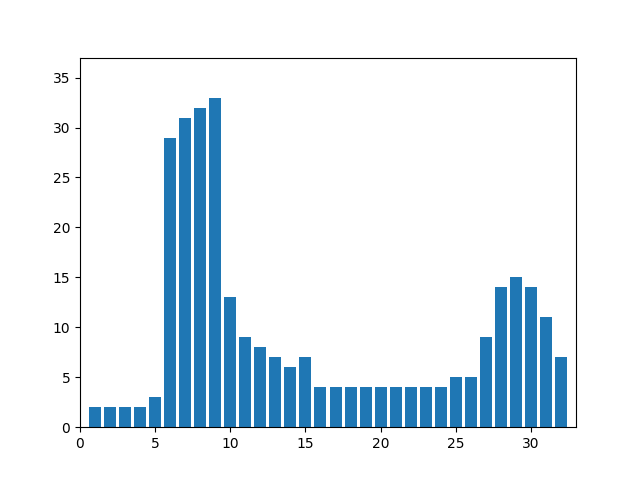| 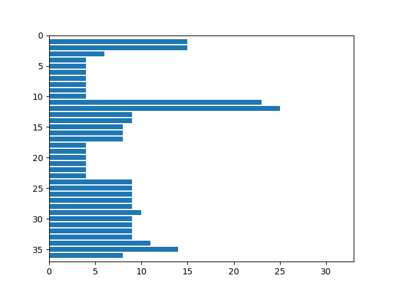|

|Признак|Значение|
|-------|--------|
|Вес чёрного|302|
|Нормированный вес чёрного|0.2621527777777778|
|Центр масс|(14, 18)|
|Нормированный центр масс|(0.41935483870967744, 0.4857142857142857)|
|Моменты инерции|(35813, 26060)|
|Нормированные моменты инерции|(15.436637931034483, 11.232758620689655)|

### Буква ե
|Символ|Профиль по х|Профиль по y|
|---------------------|--------------------------|--------------------------|
|| 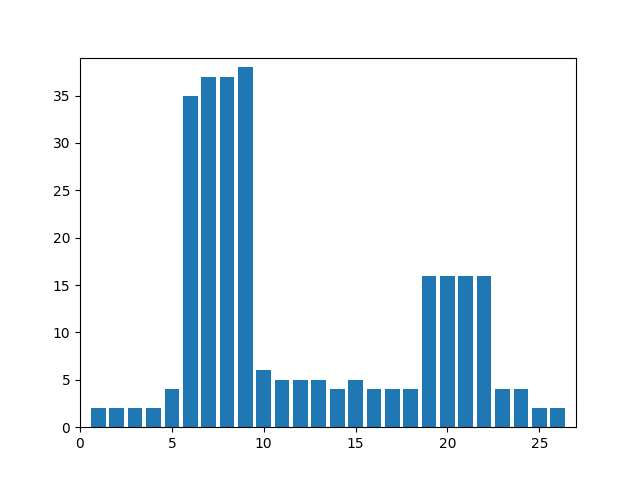| 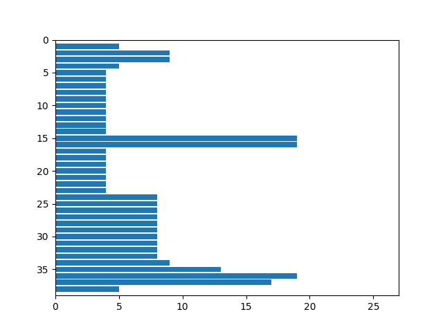|

|Признак|Значение|
|-------|--------|
|Вес чёрного|277|
|Нормированный вес чёрного|0.28036437246963564|
|Центр масс|(11, 21)|
|Нормированный центр масс|(0.4, 0.5405405405405406)|
|Моменты инерции|(35455, 10944)|
|Нормированные моменты инерции|(16.724056603773583, 5.162264150943396)|

### Буква Զ
|Символ|Профиль по х|Профиль по y|
|---------------------|--------------------------|--------------------------|
|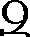| 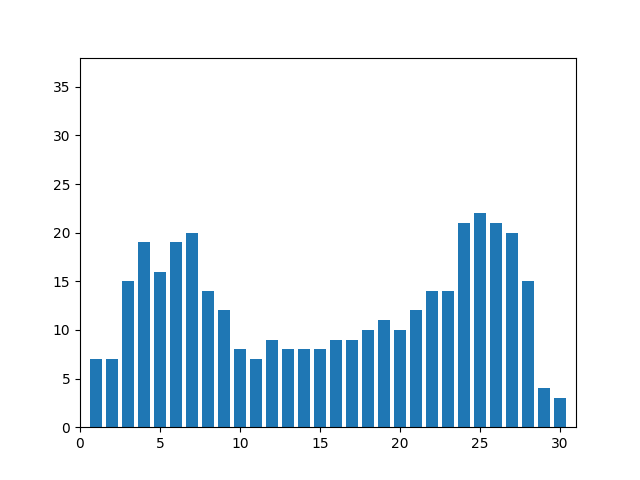| 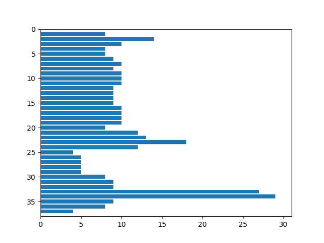|

|Признак|Значение|
|-------|--------|
|Вес чёрного|372|
|Нормированный вес чёрного|0.33513513513513515|
|Центр масс|(15, 19)|
|Нормированный центр масс|(0.4827586206896552, 0.5)|
|Моменты инерции|(44127, 28745)|
|Нормированные моменты инерции|(19.44777434993389, 12.66857646540326)|

### Буква զ
|Символ|Профиль по х|Профиль по y|
|---------------------|--------------------------|--------------------------|
|| 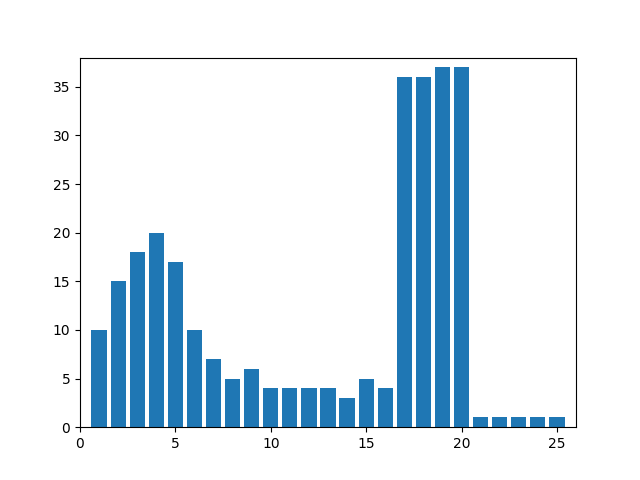| 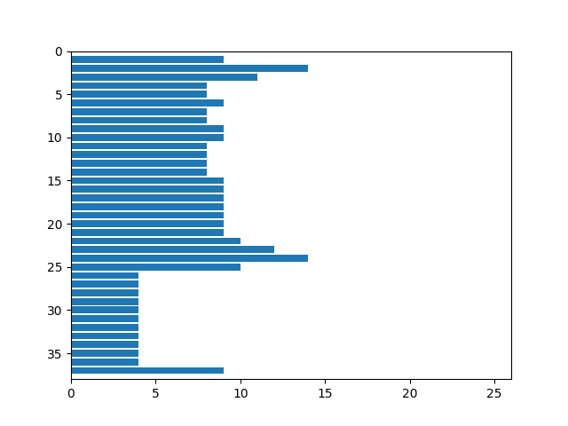|

|Признак|Значение|
|-------|--------|
|Вес чёрного|287|
|Нормированный вес чёрного|0.31027027027027027|
|Центр масс|(12, 16)|
|Нормированный центр масс|(0.4583333333333333, 0.4166666666666667)|
|Моменты инерции|(29343, 13972)|
|Нормированные моменты инерции|(14.715646940822467, 7.007021063189569)|

### Буква Է
|Символ|Профиль по х|Профиль по y|
|---------------------|--------------------------|--------------------------|
|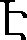| 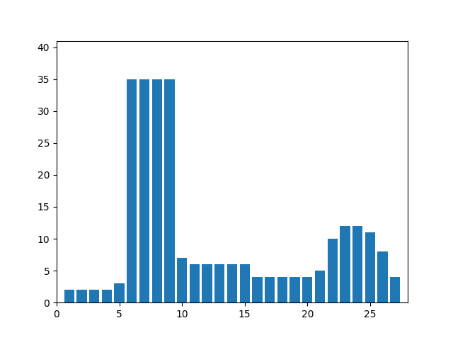| 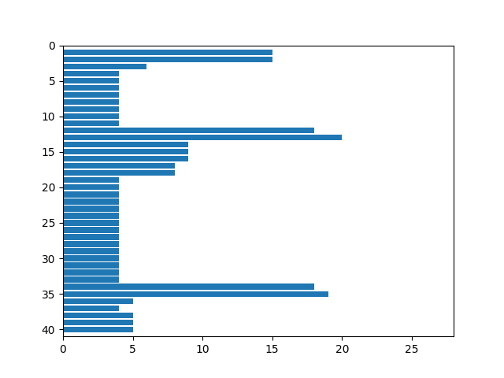|

|Признак|Значение|
|-------|--------|
|Вес чёрного|270|
|Нормированный вес чёрного|0.25|
|Центр масс|(12, 18)|
|Нормированный центр масс|(0.4230769230769231, 0.4358974358974359)|
|Моменты инерции|(38948, 13659)|
|Нормированные моменты инерции|(16.7230571060541, 5.864748819235723)|

### Буква է
|Символ|Профиль по х|Профиль по y|
|---------------------|--------------------------|--------------------------|
|| 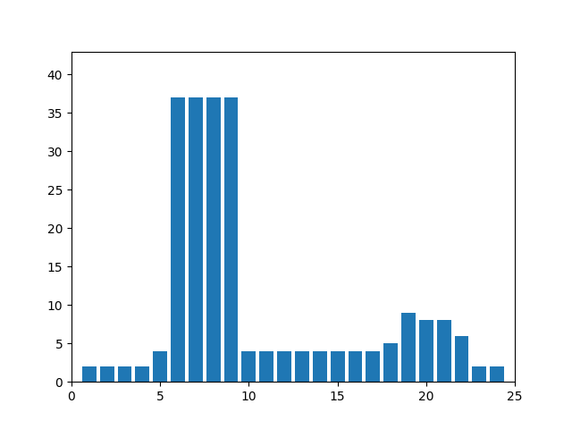| 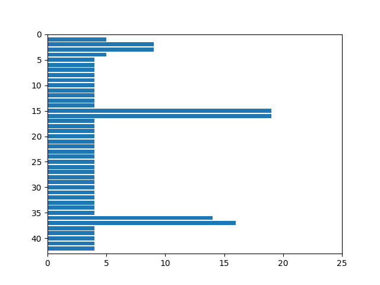|

|Признак|Значение|
|-------|--------|
|Вес чёрного|232|
|Нормированный вес чёрного|0.23015873015873015|
|Центр масс|(9, 20)|
|Нормированный центр масс|(0.34782608695652173, 0.4634146341463415)|
|Моменты инерции|(35075, 6641)|
|Нормированные моменты инерции|(14.989316239316238, 2.838034188034188)|

### Буква Ը
|Символ|Профиль по х|Профиль по y|
|---------------------|--------------------------|--------------------------|
|| 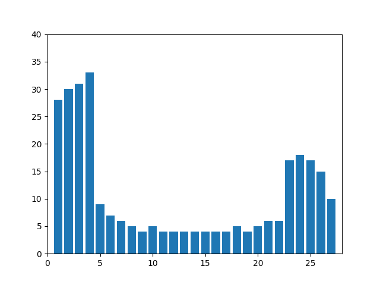| 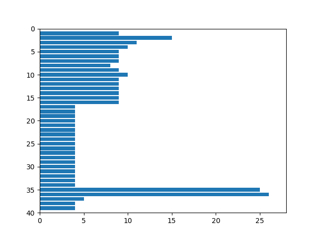|

|Признак|Значение|
|-------|--------|
|Вес чёрного|289|
|Нормированный вес чёрного|0.2744539411206078|
|Центр масс|(11, 18)|
|Нормированный центр масс|(0.38461538461538464, 0.4473684210526316)|
|Моменты инерции|(44925, 26708)|
|Нормированные моменты инерции|(19.966666666666665, 11.870222222222223)|

### Буква ը
|Символ|Профиль по х|Профиль по y|
|---------------------|--------------------------|--------------------------|
|| 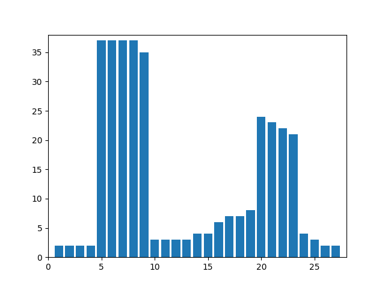| 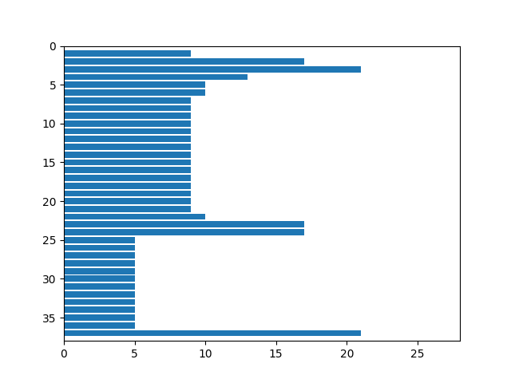|

|Признак|Значение|
|-------|--------|
|Вес чёрного|340|
|Нормированный вес чёрного|0.34034034034034033|
|Центр масс|(12, 16)|
|Нормированный центр масс|(0.4230769230769231, 0.4166666666666667)|
|Моменты инерции|(40572, 16757)|
|Нормированные моменты инерции|(19.338417540514776, 7.987130600571973)|

### Буква Թ
|Символ|Профиль по х|Профиль по y|
|---------------------|--------------------------|--------------------------|
|| 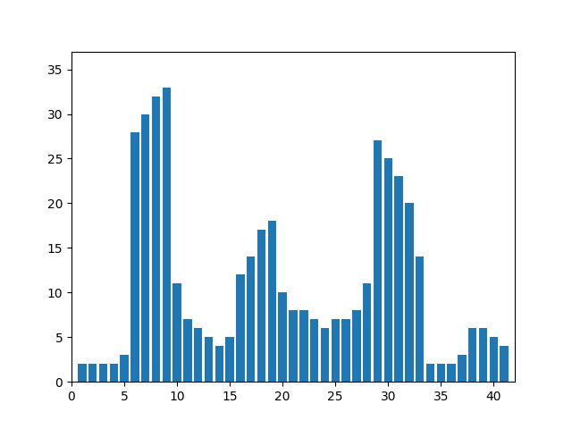| 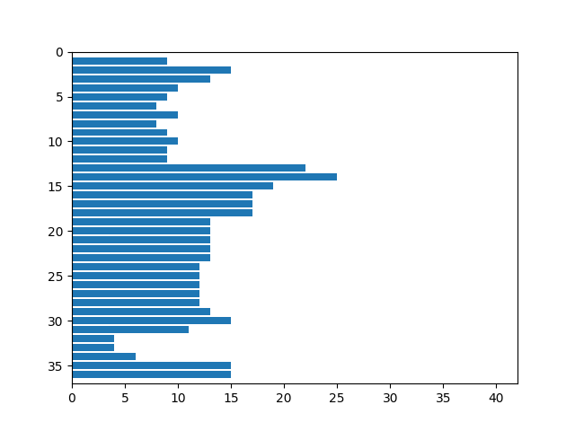|

|Признак|Значение|
|-------|--------|
|Вес чёрного|444|
|Нормированный вес чёрного|0.3008130081300813|
|Центр масс|(19, 17)|
|Нормированный центр масс|(0.45, 0.45714285714285713)|
|Моменты инерции|(42031, 49796)|
|Нормированные моменты инерции|(14.118575747396708, 16.726906281491434)|

### Буква թ
|Символ|Профиль по х|Профиль по y|
|---------------------|--------------------------|--------------------------|
|| 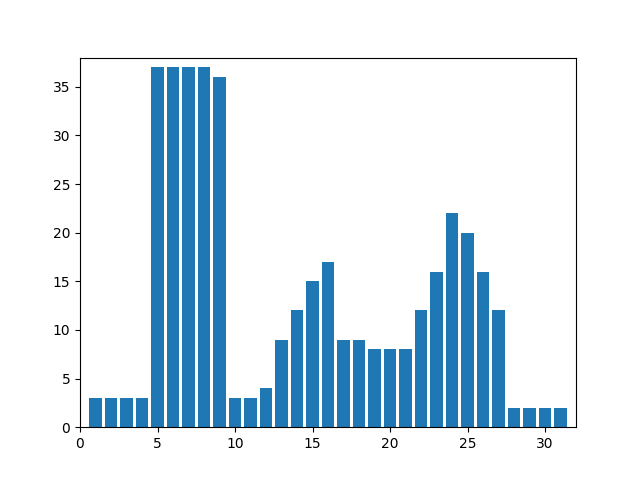| 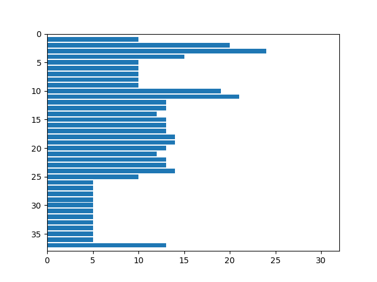|

|Признак|Значение|
|-------|--------|
|Вес чёрного|407|
|Нормированный вес чёрного|0.3548387096774194|
|Центр масс|(13, 15)|
|Нормированный центр масс|(0.4, 0.3888888888888889)|
|Моменты инерции|(40303, 25248)|
|Нормированные моменты инерции|(17.297424892703862, 10.836051502145922)|

### Буква Ժ
|Символ|Профиль по х|Профиль по y|
|---------------------|--------------------------|--------------------------|
|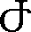| 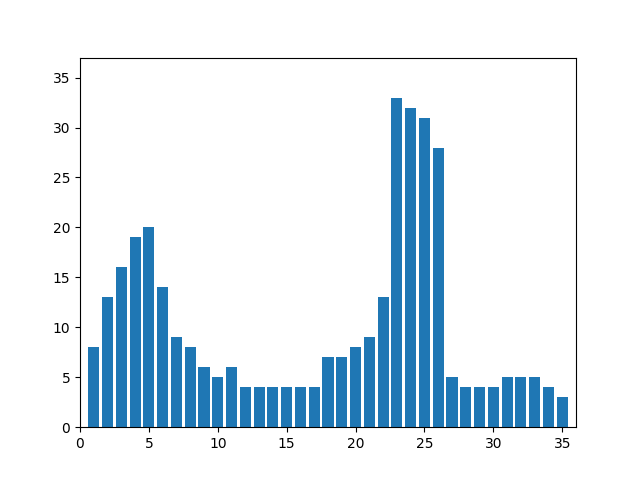| |

|Признак|Значение|
|-------|--------|
|Вес чёрного|355|
|Нормированный вес чёрного|0.28174603174603174|
|Центр масс|(16, 18)|
|Нормированный центр масс|(0.4411764705882353, 0.4857142857142857)|
|Моменты инерции|(37153, 33840)|
|Нормированные моменты инерции|(14.737405791352638, 13.423244744149148)|

### Буква ժ
|Символ|Профиль по х|Профиль по y|
|---------------------|--------------------------|--------------------------|
|| 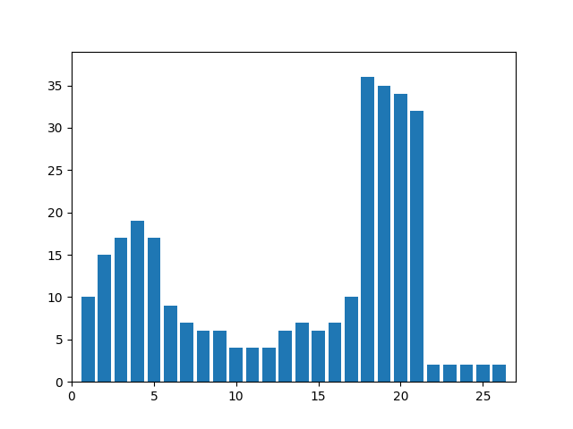| 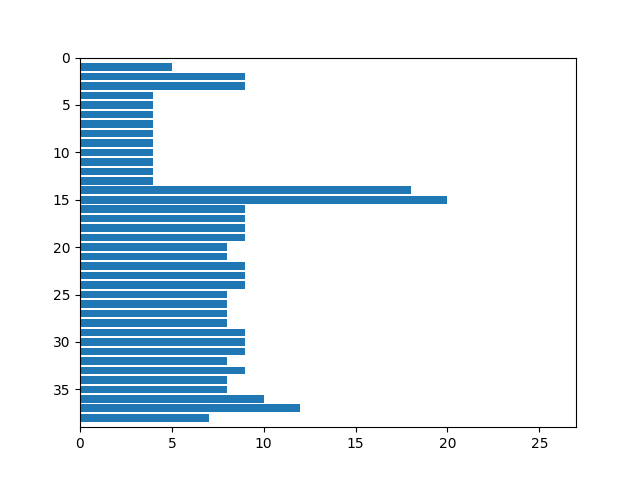|

|Признак|Значение|
|-------|--------|
|Вес чёрного|301|
|Нормированный вес чёрного|0.30465587044534415|
|Центр масс|(12, 20)|
|Нормированный центр масс|(0.44, 0.5135135135135135)|
|Моменты инерции|(32709, 15935)|
|Нормированные моменты инерции|(15.42877358490566, 7.5165094339622645)|

### Буква Ի
|Символ|Профиль по х|Профиль по y|
|---------------------|--------------------------|--------------------------|
|| 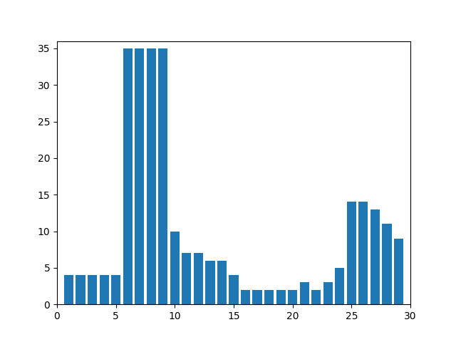| 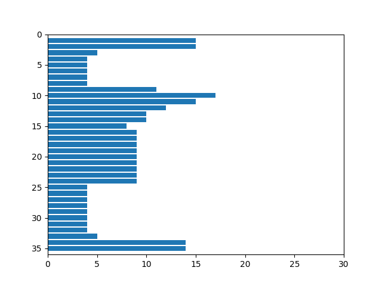|

|Признак|Значение|
|-------|--------|
|Вес чёрного|284|
|Нормированный вес чёрного|0.2798029556650246|
|Центр масс|(12, 16)|
|Нормированный центр масс|(0.39285714285714285, 0.4411764705882353)|
|Моменты инерции|(28845, 19835)|
|Нормированные моменты инерции|(13.961761858664085, 9.600677637947726)|

### Буква ի
|Символ|Профиль по х|Профиль по y|
|---------------------|--------------------------|--------------------------|
|| 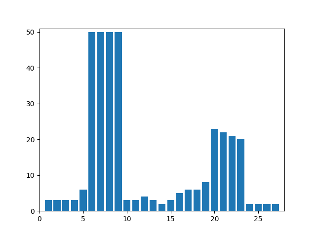| 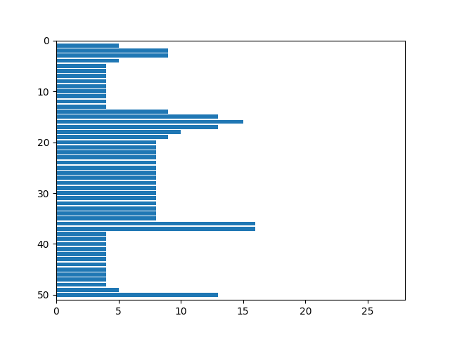|

|Признак|Значение|
|-------|--------|
|Вес чёрного|355|
|Нормированный вес чёрного|0.26296296296296295|
|Центр масс|(11, 24)|
|Нормированный центр масс|(0.38461538461538464, 0.46938775510204084)|
|Моменты инерции|(62369, 15825)|
|Нормированные моменты инерции|(19.315267884794054, 4.900898110870238)|

### Буква Լ
|Символ|Профиль по х|Профиль по y|
|---------------------|--------------------------|--------------------------|
|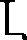| | 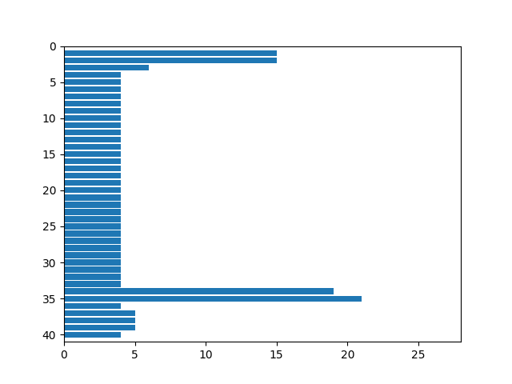|

|Признак|Значение|
|-------|--------|
|Вес чёрного|219|
|Нормированный вес чёрного|0.20277777777777778|
|Центр масс|(10, 20)|
|Нормированный центр масс|(0.34615384615384615, 0.48717948717948717)|
|Моменты инерции|(37115, 9260)|
|Нормированные моменты инерции|(15.936024044654358, 3.9759553456419066)|

### Буква լ
|Символ|Профиль по х|Профиль по y|
|---------------------|--------------------------|--------------------------|
|| 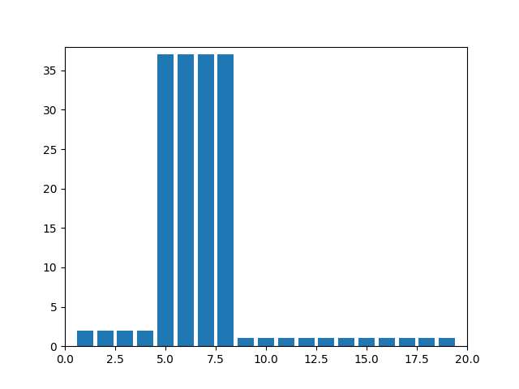| 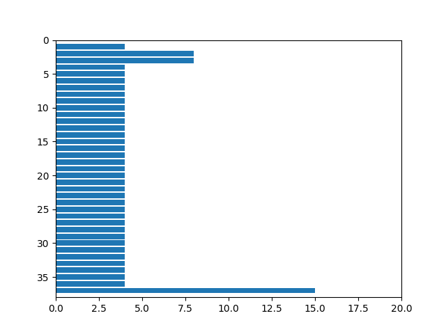|

|Признак|Значение|
|-------|--------|
|Вес чёрного|167|
|Нормированный вес чёрного|0.2375533428165007|
|Центр масс|(6, 18)|
|Нормированный центр масс|(0.2777777777777778, 0.4722222222222222)|
|Моменты инерции|(22616, 1043)|
|Нормированные моменты инерции|(13.072832369942196, 0.6028901734104046)|

### Буква Խ
|Символ|Профиль по х|Профиль по y|
|---------------------|--------------------------|--------------------------|
|| | 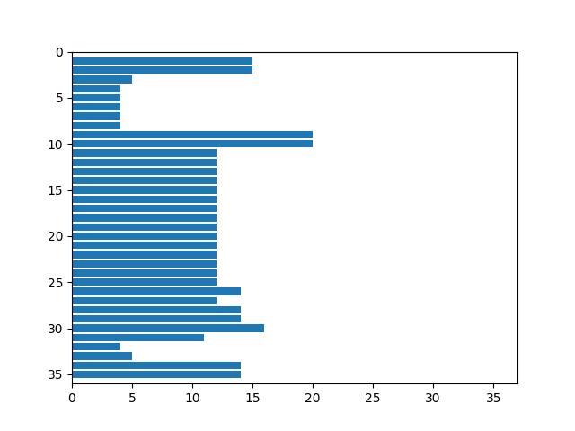|

|Признак|Значение|
|-------|--------|
|Вес чёрного|393|
|Нормированный вес чёрного|0.3119047619047619|
|Центр масс|(16, 18)|
|Нормированный центр масс|(0.42857142857142855, 0.5)|
|Моменты инерции|(36953, 46378)|
|Нормированные моменты инерции|(14.658072193573979, 18.396667988893295)|

### Буква խ
|Символ|Профиль по х|Профиль по y|
|---------------------|--------------------------|--------------------------|
|| 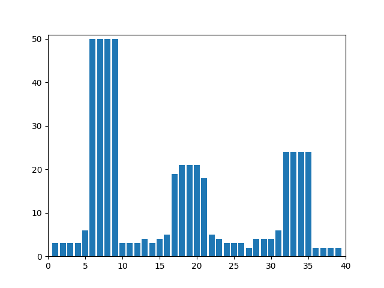| 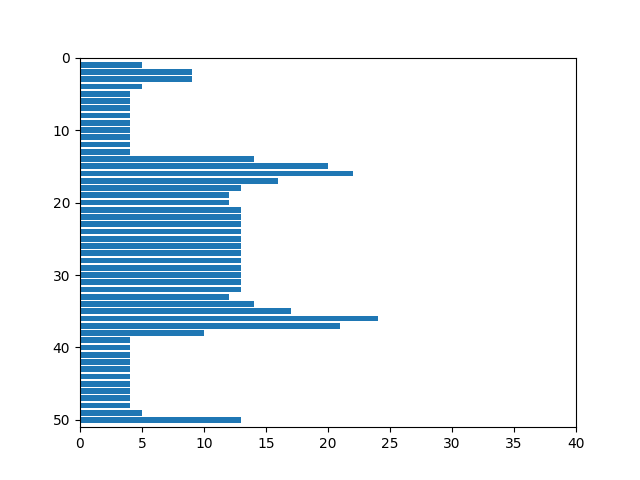|

|Признак|Значение|
|-------|--------|
|Вес чёрного|485|
|Нормированный вес чёрного|0.24871794871794872|
|Центр масс|(16, 25)|
|Нормированный центр масс|(0.39473684210526316, 0.4897959183673469)|
|Моменты инерции|(69771, 56317)|
|Нормированные моменты инерции|(17.351653817458345, 14.005719970156678)|

### Буква Ծ
|Символ|Профиль по х|Профиль по y|
|---------------------|--------------------------|--------------------------|
|| 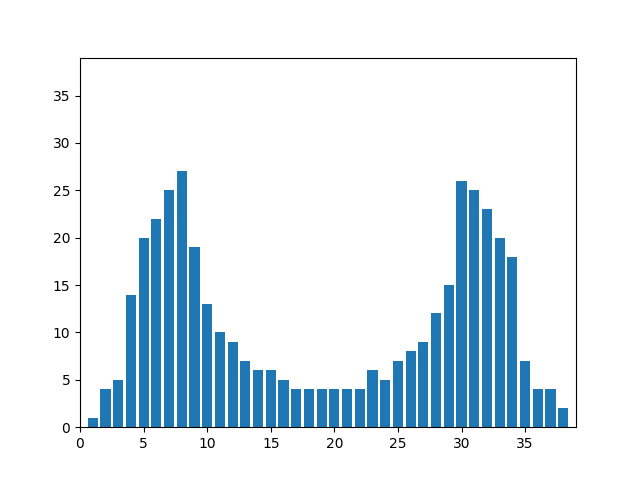| 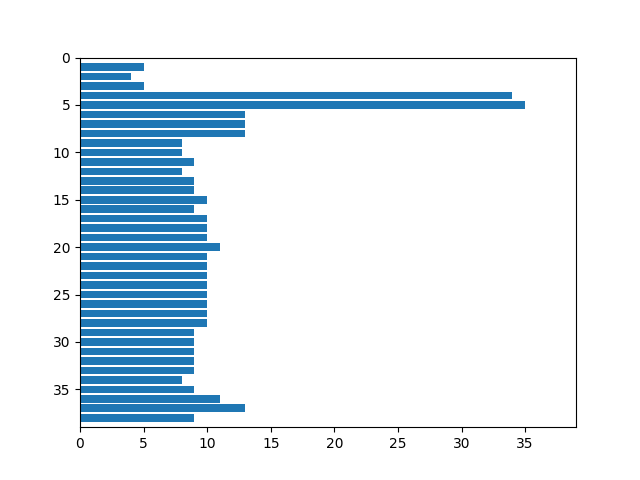|

|Признак|Значение|
|-------|--------|
|Вес чёрного|408|
|Нормированный вес чёрного|0.28254847645429365|
|Центр масс|(18, 17)|
|Нормированный центр масс|(0.4594594594594595, 0.43243243243243246)|
|Моменты инерции|(51367, 52550)|
|Нормированные моменты инерции|(17.786357340720222, 18.195983379501385)|

### Буква ծ
|Символ|Профиль по х|Профиль по y|
|---------------------|--------------------------|--------------------------|
|| 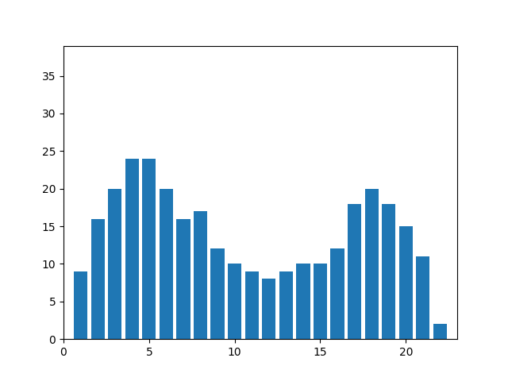| |

|Признак|Значение|
|-------|--------|
|Вес чёрного|310|
|Нормированный вес чёрного|0.3708133971291866|
|Центр масс|(10, 21)|
|Нормированный центр масс|(0.42857142857142855, 0.5405405405405406)|
|Моменты инерции|(30105, 12414)|
|Нормированные моменты инерции|(15.614626556016598, 6.4387966804979255)|

### Буква Կ
|Символ|Профиль по х|Профиль по y|
|---------------------|--------------------------|--------------------------|
|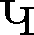| 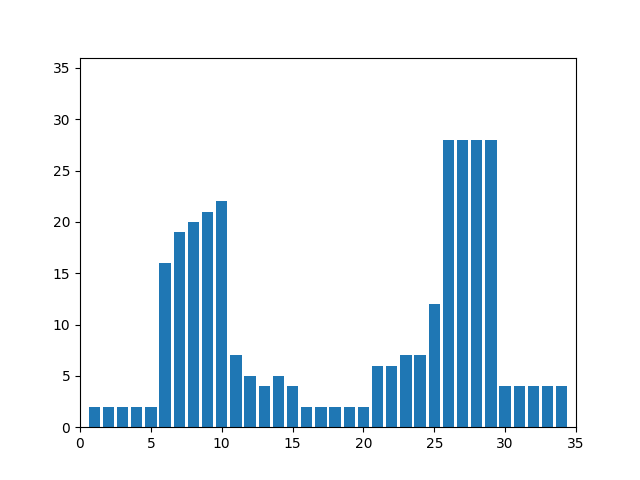| 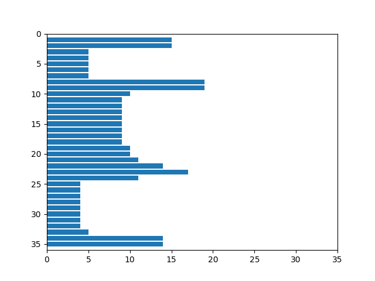|

|Признак|Значение|
|-------|--------|
|Вес чёрного|313|
|Нормированный вес чёрного|0.2630252100840336|
|Центр масс|(18, 16)|
|Нормированный центр масс|(0.5151515151515151, 0.4411764705882353)|
|Моменты инерции|(31007, 27827)|
|Нормированные моменты инерции|(13.022679546409071, 11.687106257874843)|

### Буква կ
|Символ|Профиль по х|Профиль по y|
|---------------------|--------------------------|--------------------------|
|| 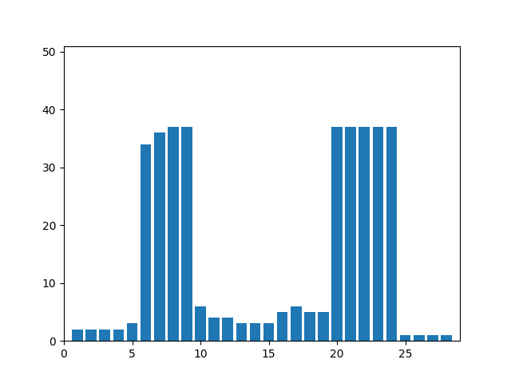| |

|Признак|Значение|
|-------|--------|
|Вес чёрного|388|
|Нормированный вес чёрного|0.27714285714285714|
|Центр масс|(14, 26)|
|Нормированный центр масс|(0.48148148148148145, 0.5102040816326531)|
|Моменты инерции|(66492, 20151)|
|Нормированные моменты инерции|(20.247259439707673, 6.136114494518879)|

### Буква Հ
|Символ|Профиль по х|Профиль по y|
|---------------------|--------------------------|--------------------------|
|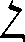| 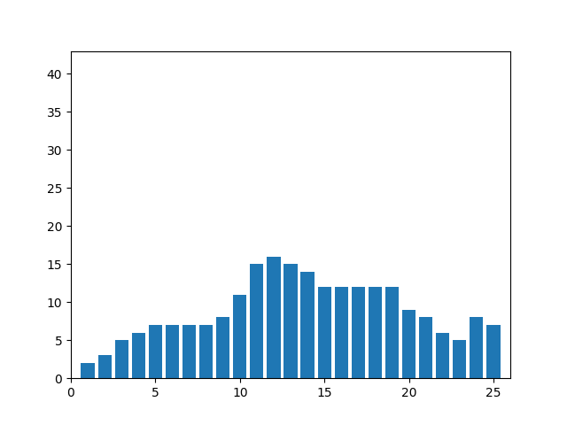| 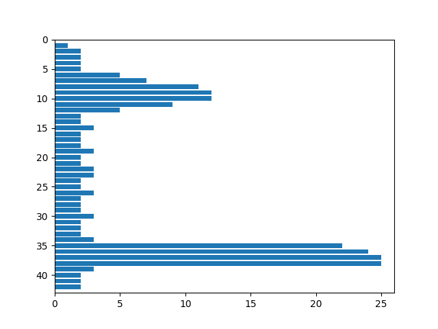|

|Признак|Значение|
|-------|--------|
|Вес чёрного|226|
|Нормированный вес чёрного|0.21523809523809523|
|Центр масс|(13, 24)|
|Нормированный центр масс|(0.5, 0.5609756097560976)|
|Моменты инерции|(37100, 7987)|
|Нормированные моменты инерции|(15.52951025533696, 3.3432398493093345)|

### Буква հ
|Символ|Профиль по х|Профиль по y|
|---------------------|--------------------------|--------------------------|
|| 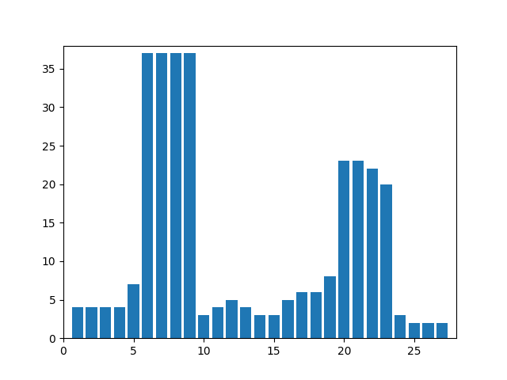| 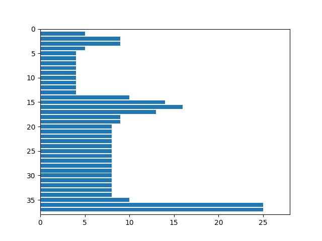|

|Признак|Значение|
|-------|--------|
|Вес чёрного|315|
|Нормированный вес чёрного|0.3153153153153153|
|Центр масс|(12, 21)|
|Нормированный центр масс|(0.4230769230769231, 0.5555555555555556)|
|Моменты инерции|(36905, 15298)|
|Нормированные моменты инерции|(17.590562440419447, 7.291706387035272)|

### Буква Ձ
|Символ|Профиль по х|Профиль по y|
|---------------------|--------------------------|--------------------------|
|| 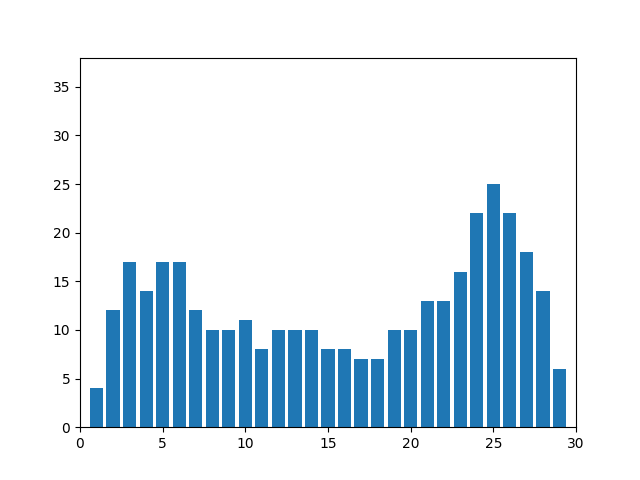| 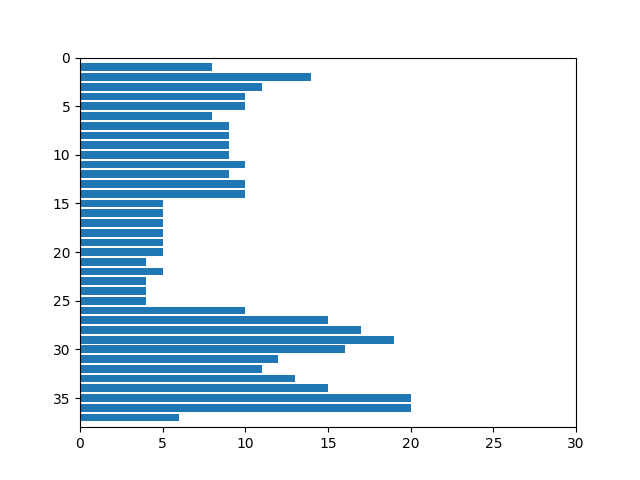|

|Признак|Значение|
|-------|--------|
|Вес чёрного|361|
|Нормированный вес чёрного|0.3364398881640261|
|Центр масс|(15, 20)|
|Нормированный центр масс|(0.5, 0.5277777777777778)|
|Моменты инерции|(49202, 27597)|
|Нормированные моменты инерции|(22.263348416289592, 12.487330316742081)|

### Буква ձ
|Символ|Профиль по х|Профиль по y|
|---------------------|--------------------------|--------------------------|
|| | 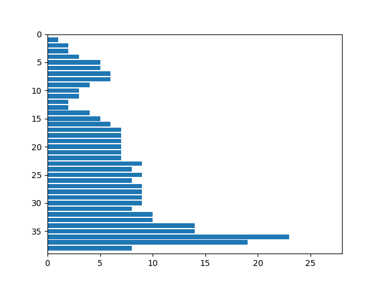|

|Признак|Значение|
|-------|--------|
|Вес чёрного|277|
|Нормированный вес чёрного|0.2699805068226121|
|Центр масс|(11, 24)|
|Нормированный центр масс|(0.38461538461538464, 0.6216216216216216)|
|Моменты инерции|(28545, 11260)|
|Нормированные моменты инерции|(13.136217211228717, 5.181776346065347)|

### Буква Կ
|Символ|Профиль по х|Профиль по y|
|---------------------|--------------------------|--------------------------|
|| | |

|Признак|Значение|
|-------|--------|
|Вес чёрного|313|
|Нормированный вес чёрного|0.2630252100840336|
|Центр масс|(18, 16)|
|Нормированный центр масс|(0.5151515151515151, 0.4411764705882353)|
|Моменты инерции|(31007, 27827)|
|Нормированные моменты инерции|(13.022679546409071, 11.687106257874843)|

### Буква կ
|Символ|Профиль по х|Профиль по y|
|---------------------|--------------------------|--------------------------|
|| | |

|Признак|Значение|
|-------|--------|
|Вес чёрного|388|
|Нормированный вес чёрного|0.27714285714285714|
|Центр масс|(14, 26)|
|Нормированный центр масс|(0.48148148148148145, 0.5102040816326531)|
|Моменты инерции|(66492, 20151)|
|Нормированные моменты инерции|(20.247259439707673, 6.136114494518879)|

### Буква Ճ
|Символ|Профиль по х|Профиль по y|
|---------------------|--------------------------|--------------------------|
|| 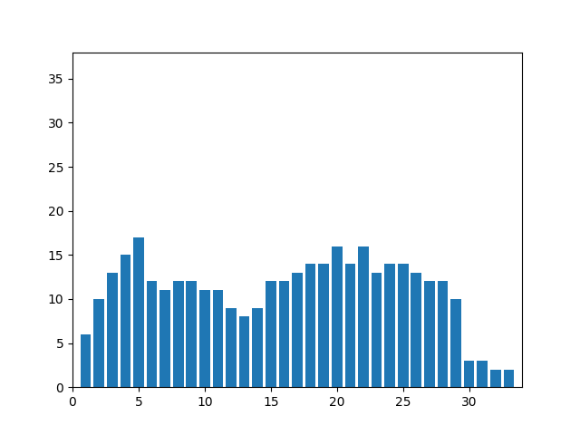| 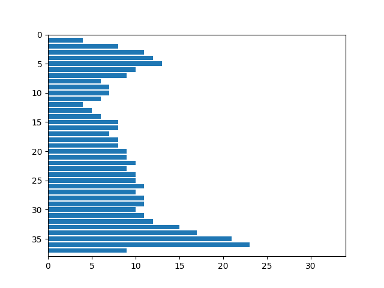|

|Признак|Значение|
|-------|--------|
|Вес чёрного|365|
|Нормированный вес чёрного|0.2989352989352989|
|Центр масс|(15, 21)|
|Нормированный центр масс|(0.4375, 0.5555555555555556)|
|Моменты инерции|(46123, 26673)|
|Нормированные моменты инерции|(18.764442636289665, 10.851505288852726)|

### Буква ճ
|Символ|Профиль по х|Профиль по y|
|---------------------|--------------------------|--------------------------|
|| 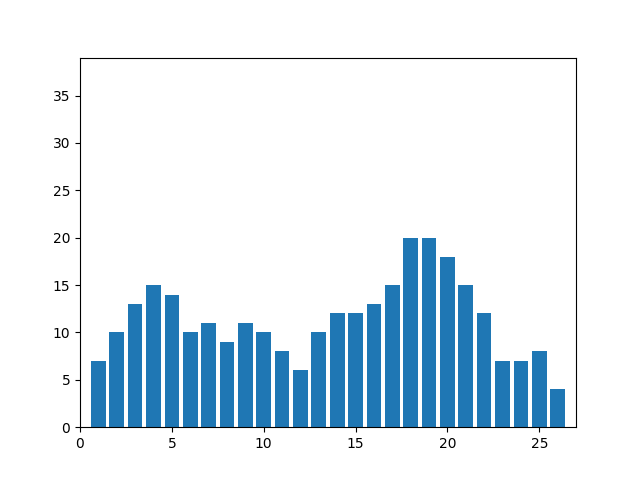| 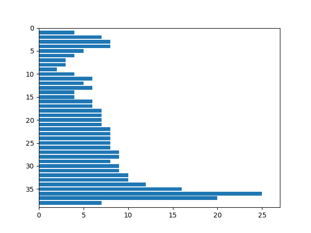|

|Признак|Значение|
|-------|--------|
|Вес чёрного|297|
|Нормированный вес чёрного|0.3006072874493927|
|Центр масс|(13, 23)|
|Нормированный центр масс|(0.48, 0.5945945945945946)|
|Моменты инерции|(36874, 14855)|
|Нормированные моменты инерции|(17.393396226415096, 7.007075471698113)|

### Буква Մ
|Символ|Профиль по х|Профиль по y|
|---------------------|--------------------------|--------------------------|
|| 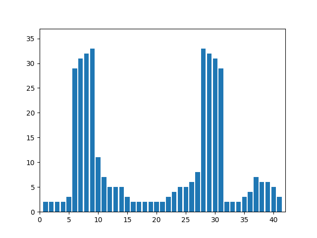| 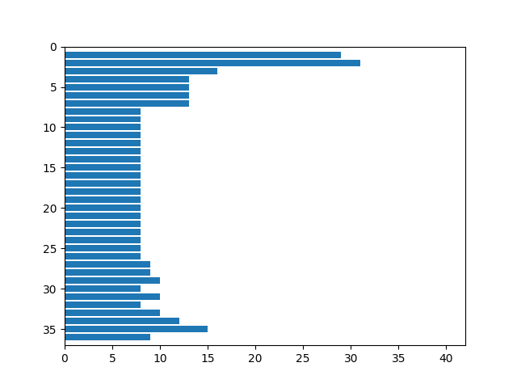|

|Признак|Значение|
|-------|--------|
|Вес чёрного|380|
|Нормированный вес чёрного|0.25745257452574527|
|Центр масс|(19, 15)|
|Нормированный центр масс|(0.45, 0.4)|
|Моменты инерции|(51549, 49555)|
|Нормированные моменты инерции|(17.315754114880754, 16.645952300974134)|

### Буква մ
|Символ|Профиль по х|Профиль по y|
|---------------------|--------------------------|--------------------------|
|| 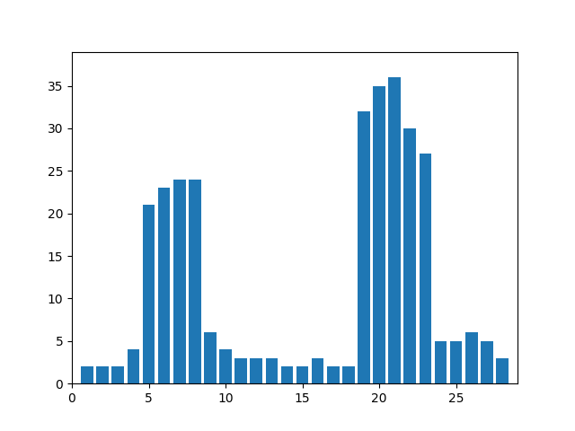| 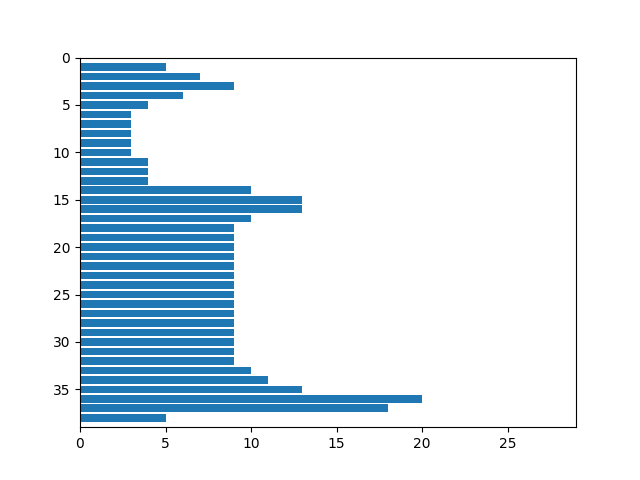|

|Признак|Значение|
|-------|--------|
|Вес чёрного|316|
|Нормированный вес чёрного|0.29699248120300753|
|Центр масс|(15, 22)|
|Нормированный центр масс|(0.5185185185185185, 0.5675675675675675)|
|Моменты инерции|(35369, 17198)|
|Нормированные моменты инерции|(15.874775583482945, 7.71903052064632)|

### Буква Յ
|Символ|Профиль по х|Профиль по y|
|---------------------|--------------------------|--------------------------|
|| 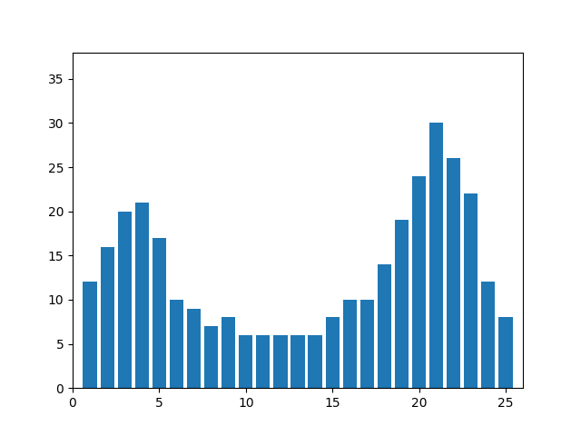| 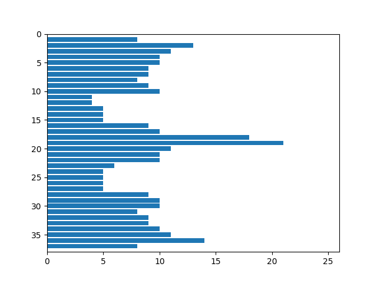|

|Признак|Значение|
|-------|--------|
|Вес чёрного|333|
|Нормированный вес чёрного|0.36|
|Центр масс|(13, 18)|
|Нормированный центр масс|(0.5, 0.4722222222222222)|
|Моменты инерции|(40033, 20727)|
|Нормированные моменты инерции|(20.076730190571716, 10.39468405215647)|

### Буква յ
|Символ|Профиль по х|Профиль по y|
|---------------------|--------------------------|--------------------------|
|| 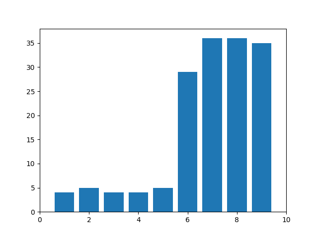| 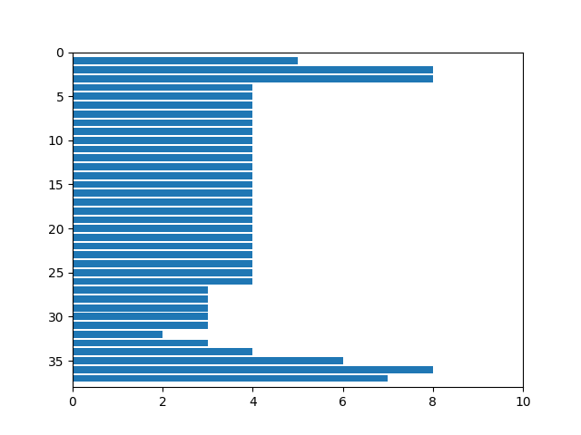|

|Признак|Значение|
|-------|--------|
|Вес чёрного|158|
|Нормированный вес чёрного|0.4744744744744745|
|Центр масс|(6, 17)|
|Нормированный центр масс|(0.625, 0.4444444444444444)|
|Моменты инерции|(20958, 594)|
|Нормированные моменты инерции|(14.453793103448277, 0.4096551724137931)|

### Буква Ն
|Символ|Профиль по х|Профиль по y|
|---------------------|--------------------------|--------------------------|
|| 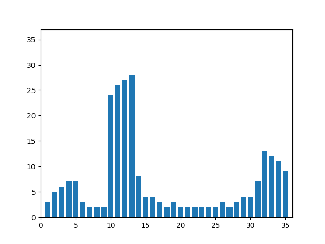| 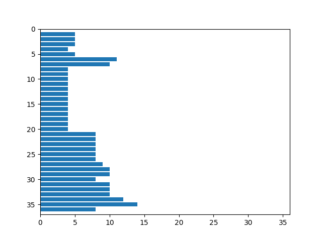|

|Признак|Значение|
|-------|--------|
|Вес чёрного|246|
|Нормированный вес чёрного|0.19523809523809524|
|Центр масс|(16, 20)|
|Нормированный центр масс|(0.4411764705882353, 0.5428571428571428)|
|Моменты инерции|(28336, 25374)|
|Нормированные моменты инерции|(11.239984133280444, 10.0650535501785)|

### Буква ն
|Символ|Профиль по х|Профиль по y|
|---------------------|--------------------------|--------------------------|
|| 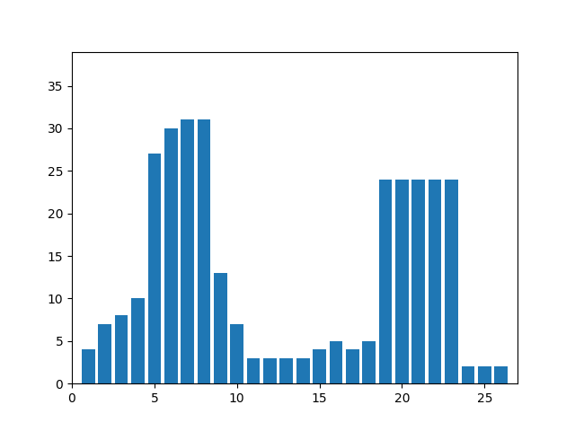| 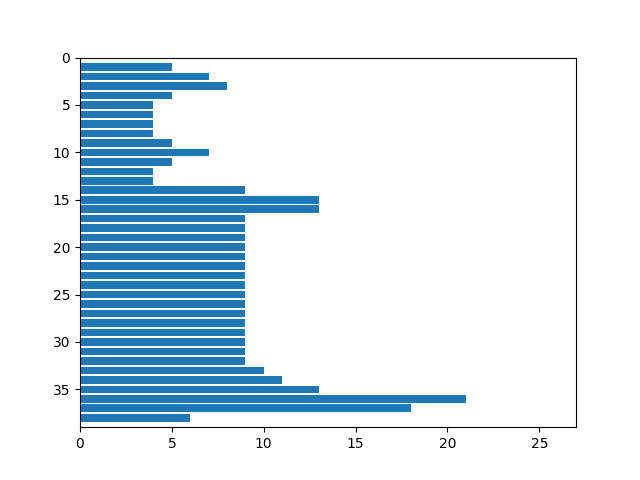|

|Признак|Значение|
|-------|--------|
|Вес чёрного|324|
|Нормированный вес чёрного|0.32793522267206476|
|Центр масс|(12, 22)|
|Нормированный центр масс|(0.44, 0.5675675675675675)|
|Моменты инерции|(36867, 17449)|
|Нормированные моменты инерции|(17.390094339622642, 8.230660377358491)|

### Буква Շ
|Символ|Профиль по х|Профиль по y|
|---------------------|--------------------------|--------------------------|
|| 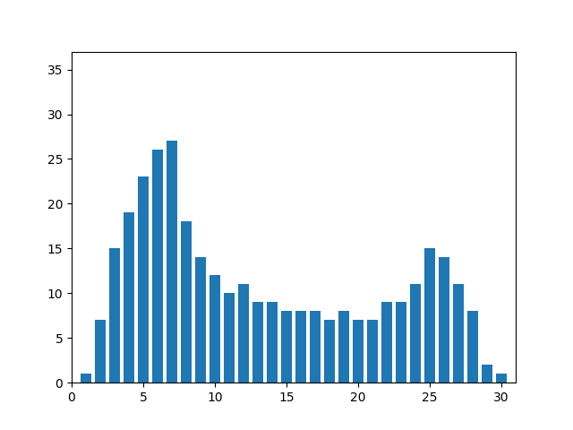| 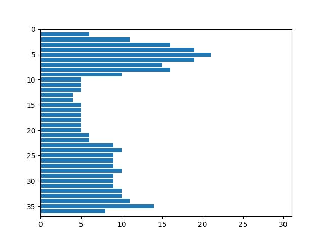|

|Признак|Значение|
|-------|--------|
|Вес чёрного|334|
|Нормированный вес чёрного|0.30925925925925923|
|Центр масс|(12, 16)|
|Нормированный центр масс|(0.3793103448275862, 0.42857142857142855)|
|Моменты инерции|(44331, 22319)|
|Нормированные моменты инерции|(20.187158469945356, 10.163479052823314)|

### Буква շ
|Символ|Профиль по х|Профиль по y|
|---------------------|--------------------------|--------------------------|
|| 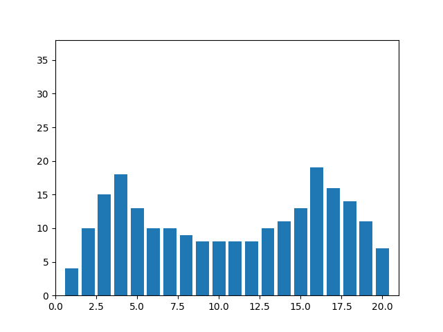| 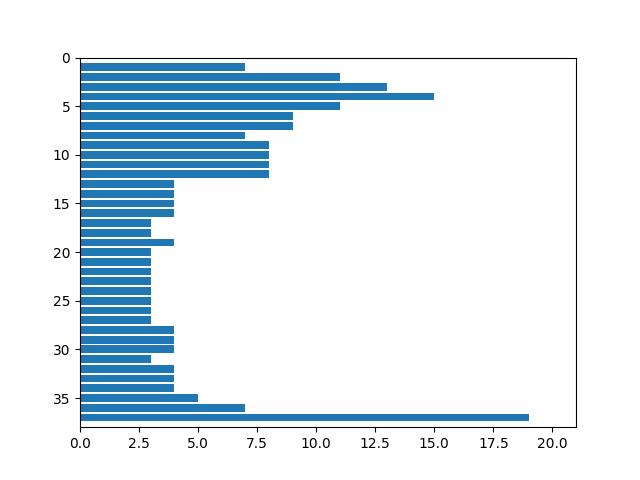|

|Признак|Значение|
|-------|--------|
|Вес чёрного|222|
|Нормированный вес чёрного|0.3|
|Центр масс|(10, 15)|
|Нормированный центр масс|(0.47368421052631576, 0.3888888888888889)|
|Моменты инерции|(33258, 7414)|
|Нормированные моменты инерции|(18.800452232899943, 4.191068400226117)|

### Буква Ո
|Символ|Профиль по х|Профиль по y|
|---------------------|--------------------------|--------------------------|
|| 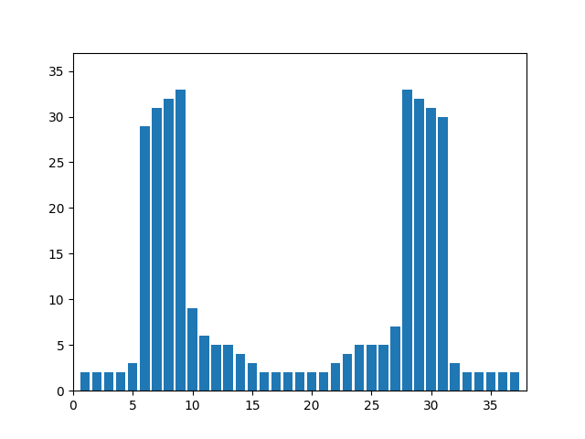| 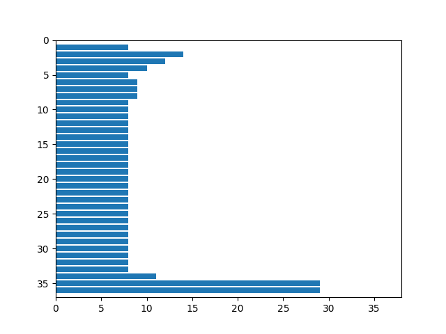|

|Признак|Значение|
|-------|--------|
|Вес чёрного|348|
|Нормированный вес чёрного|0.26126126126126126|
|Центр масс|(18, 19)|
|Нормированный центр масс|(0.4722222222222222, 0.5142857142857142)|
|Моменты инерции|(46538, 39157)|
|Нормированные моменты инерции|(17.462664165103188, 14.693058161350844)|

### Буква ո
|Символ|Профиль по х|Профиль по y|
|---------------------|--------------------------|--------------------------|
|| 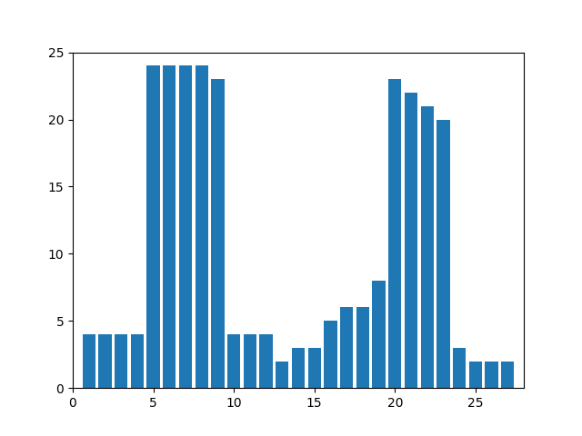| 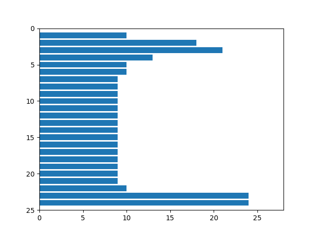|

|Признак|Значение|
|-------|--------|
|Вес чёрного|275|
|Нормированный вес чёрного|0.4243827160493827|
|Центр масс|(12, 12)|
|Нормированный центр масс|(0.4230769230769231, 0.4782608695652174)|
|Моменты инерции|(16670, 14595)|
|Нормированные моменты инерции|(12.773946360153257, 11.183908045977011)|

### Буква Չ
|Символ|Профиль по х|Профиль по y|
|---------------------|--------------------------|--------------------------|
|| 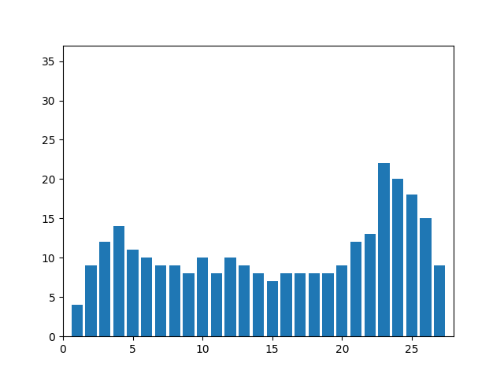| 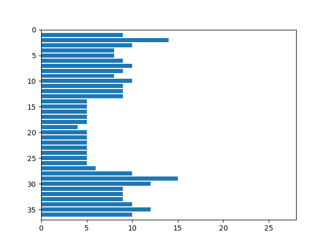|

|Признак|Значение|
|-------|--------|
|Вес чёрного|288|
|Нормированный вес чёрного|0.2962962962962963|
|Центр масс|(14, 18)|
|Нормированный центр масс|(0.5, 0.4857142857142857)|
|Моменты инерции|(37805, 18927)|
|Нормированные моменты инерции|(18.669135802469135, 9.346666666666666)|

### Буква չ
|Символ|Профиль по х|Профиль по y|
|---------------------|--------------------------|--------------------------|
|| 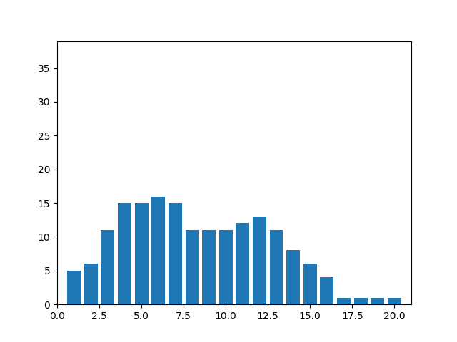| 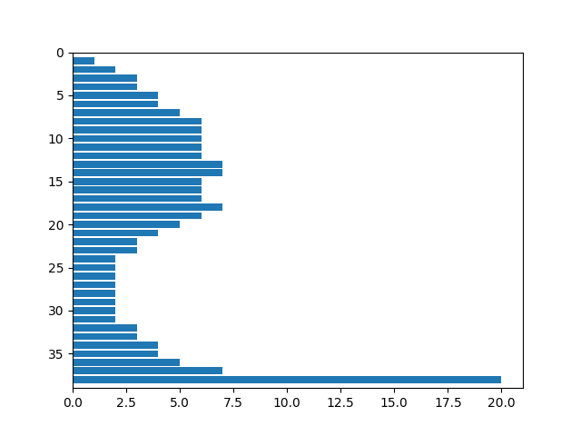|

|Признак|Значение|
|-------|--------|
|Вес чёрного|174|
|Нормированный вес чёрного|0.22894736842105262|
|Центр масс|(7, 19)|
|Нормированный центр масс|(0.3157894736842105, 0.4864864864864865)|
|Моменты инерции|(22595, 3120)|
|Нормированные моменты инерции|(12.253253796095445, 1.6919739696312364)|

### Буква Պ
|Символ|Профиль по х|Профиль по y|
|---------------------|--------------------------|--------------------------|
|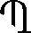| 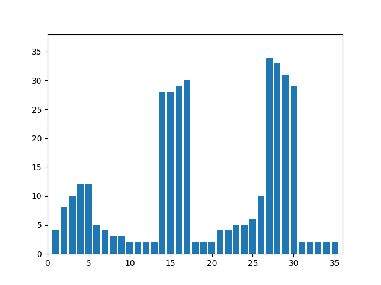| 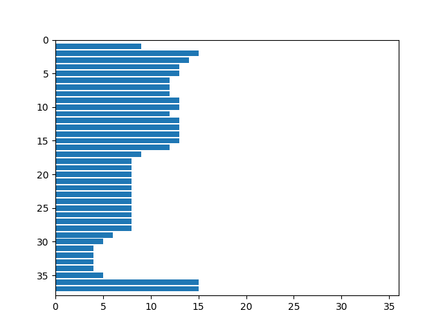|

|Признак|Значение|
|-------|--------|
|Вес чёрного|361|
|Нормированный вес чёрного|0.27876447876447874|
|Центр масс|(18, 16)|
|Нормированный центр масс|(0.5, 0.4166666666666667)|
|Моменты инерции|(41387, 29698)|
|Нормированные моменты инерции|(15.954895913646878, 11.448727833461835)|

### Буква պ
|Символ|Профиль по х|Профиль по y|
|---------------------|--------------------------|--------------------------|
|| 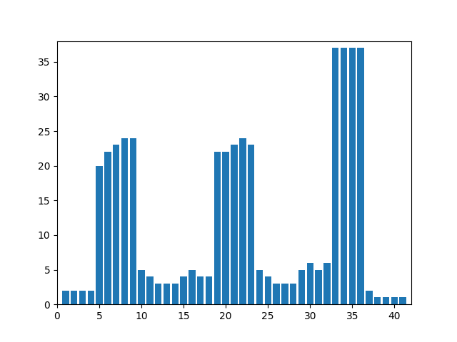| 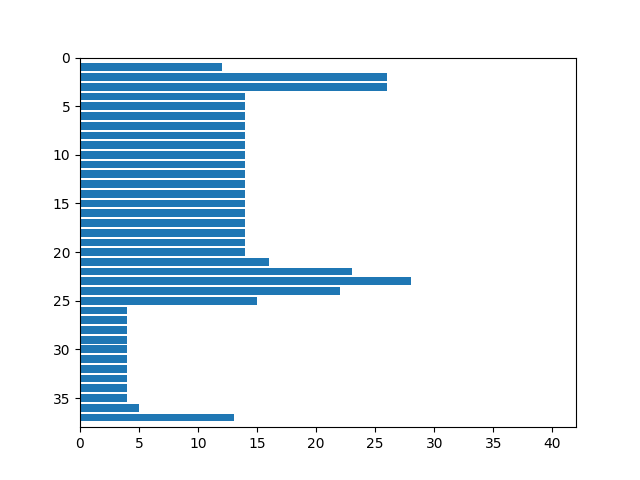|

|Признак|Значение|
|-------|--------|
|Вес чёрного|464|
|Нормированный вес чёрного|0.3058668424522083|
|Центр масс|(21, 15)|
|Нормированный центр масс|(0.5, 0.3888888888888889)|
|Моменты инерции|(43406, 58121)|
|Нормированные моменты инерции|(14.231475409836065, 19.056065573770493)|

### Буква Ջ
|Символ|Профиль по х|Профиль по y|
|---------------------|--------------------------|--------------------------|
|| 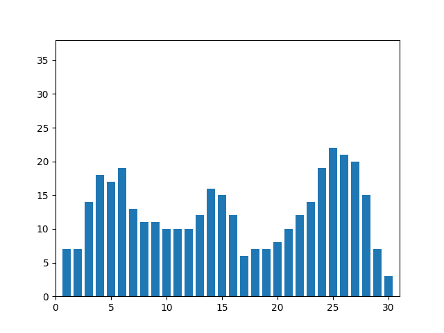| 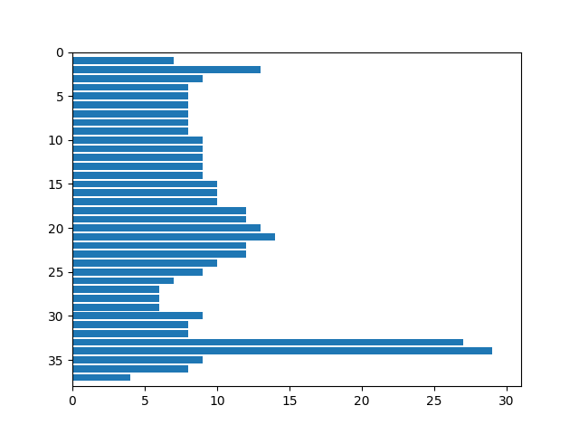|

|Признак|Значение|
|-------|--------|
|Вес чёрного|373|
|Нормированный вес чёрного|0.33603603603603605|
|Центр масс|(15, 19)|
|Нормированный центр масс|(0.4827586206896552, 0.5)|
|Моменты инерции|(42225, 28157)|
|Нормированные моменты инерции|(18.60951961216395, 12.409431467606876)|

### Буква ջ
|Символ|Профиль по х|Профиль по y|
|---------------------|--------------------------|--------------------------|
|| 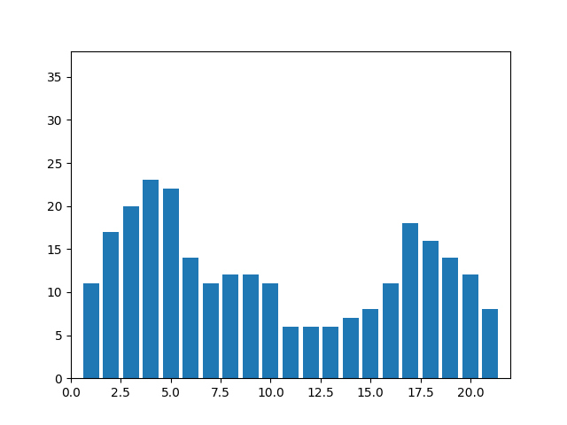| 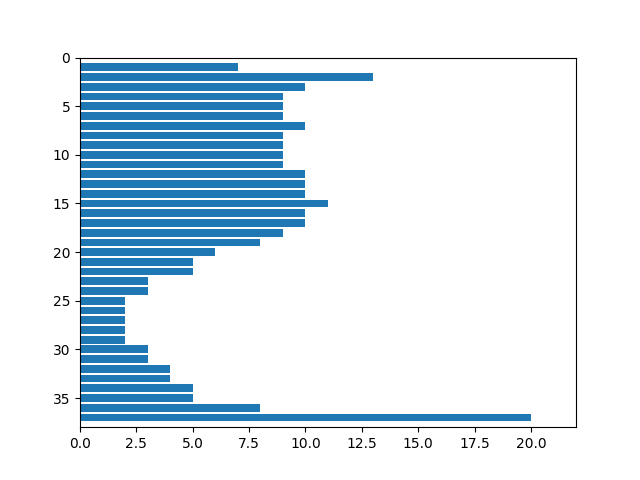|

|Признак|Значение|
|-------|--------|
|Вес чёрного|265|
|Нормированный вес чёрного|0.3410553410553411|
|Центр масс|(9, 15)|
|Нормированный центр масс|(0.4, 0.3888888888888889)|
|Моменты инерции|(32751, 10720)|
|Нормированные моменты инерции|(18.094475138121545, 5.922651933701657)|

### Буква Ռ
|Символ|Профиль по х|Профиль по y|
|---------------------|--------------------------|--------------------------|
|| 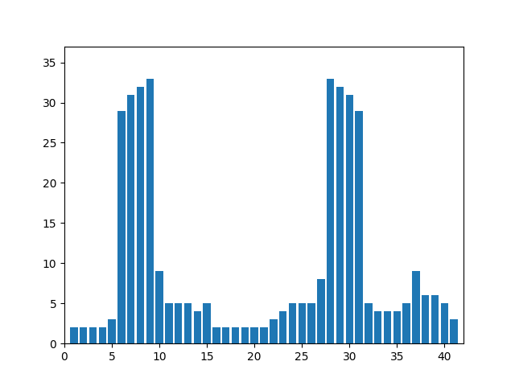| 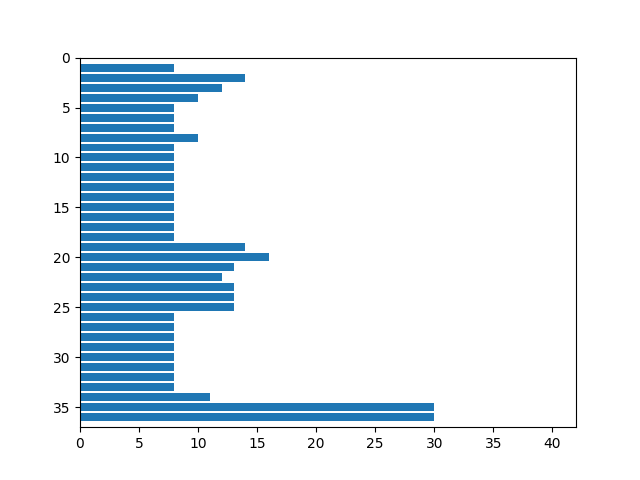|

|Признак|Значение|
|-------|--------|
|Вес чёрного|387|
|Нормированный вес чёрного|0.2621951219512195|
|Центр масс|(19, 19)|
|Нормированный центр масс|(0.45, 0.5142857142857142)|
|Моменты инерции|(47075, 51392)|
|Нормированные моменты инерции|(15.812898891501511, 17.26301645952301)|

### Буква ռ
|Символ|Профиль по х|Профиль по y|
|---------------------|--------------------------|--------------------------|
|| 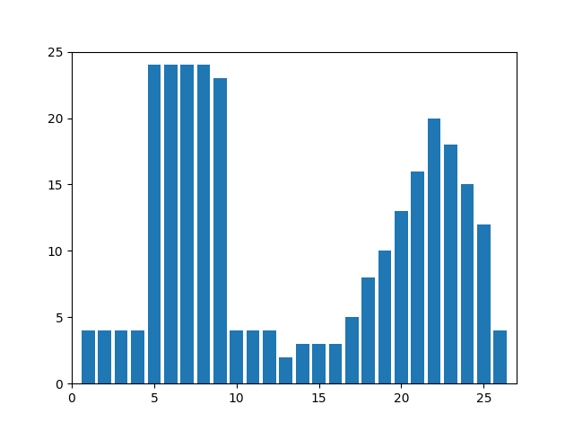| 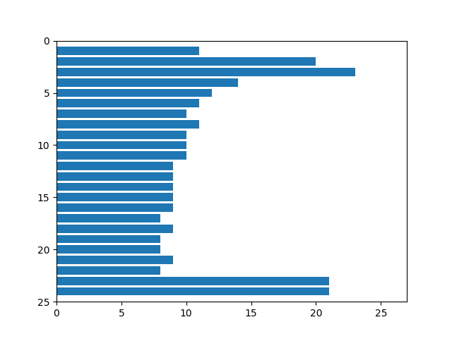|

|Признак|Значение|
|-------|--------|
|Вес чёрного|279|
|Нормированный вес чёрного|0.44711538461538464|
|Центр масс|(13, 11)|
|Нормированный центр масс|(0.48, 0.43478260869565216)|
|Моменты инерции|(16432, 16305)|
|Нормированные моменты инерции|(13.124600638977636, 13.023162939297125)|

### Буква Ս
|Символ|Профиль по х|Профиль по y|
|---------------------|--------------------------|--------------------------|
|| 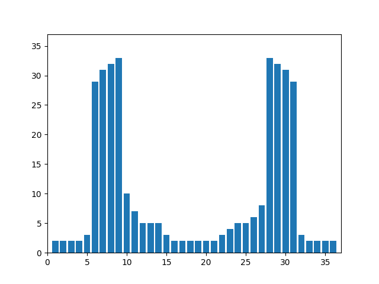| 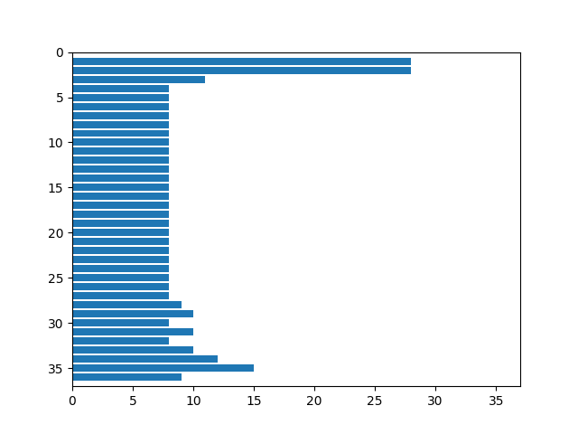|

|Признак|Значение|
|-------|--------|
|Вес чёрного|350|
|Нормированный вес чёрного|0.2700617283950617|
|Центр масс|(17, 16)|
|Нормированный центр масс|(0.45714285714285713, 0.42857142857142855)|
|Моменты инерции|(47034, 38590)|
|Нормированные моменты инерции|(18.145833333333332, 14.888117283950617)|

### Буква ս
|Символ|Профиль по х|Профиль по y|
|---------------------|--------------------------|--------------------------|
|| 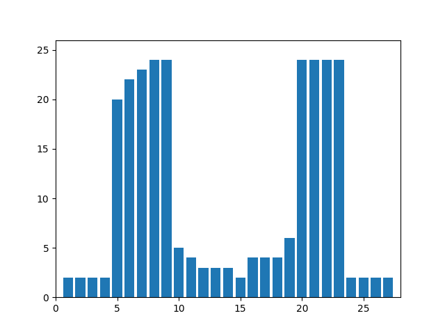| 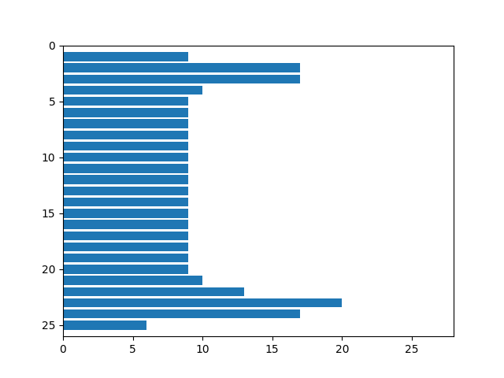|

|Признак|Значение|
|-------|--------|
|Вес чёрного|263|
|Нормированный вес чёрного|0.3896296296296296|
|Центр масс|(13, 12)|
|Нормированный центр масс|(0.46153846153846156, 0.4583333333333333)|
|Моменты инерции|(15573, 13674)|
|Нормированные моменты инерции|(11.501477104874446, 10.098966026587888)|

### Буква Վ
|Символ|Профиль по х|Профиль по y|
|---------------------|--------------------------|--------------------------|
|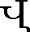| 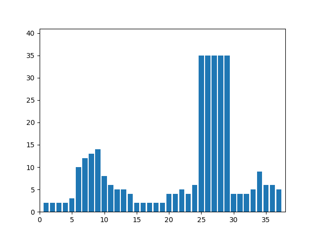| 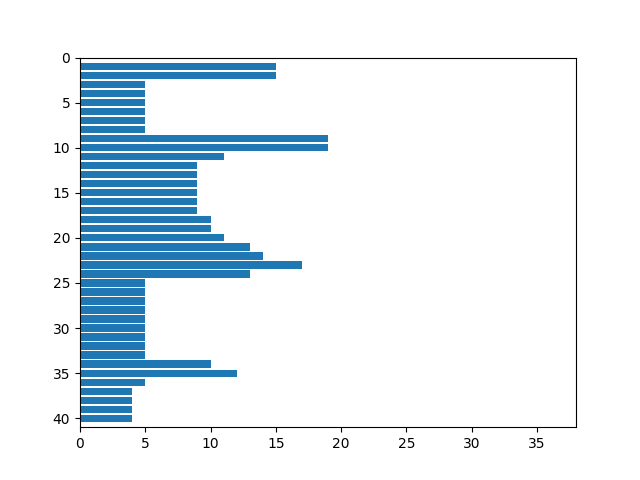|

|Признак|Значение|
|-------|--------|
|Вес чёрного|339|
|Нормированный вес чёрного|0.22905405405405405|
|Центр масс|(21, 17)|
|Нормированный центр масс|(0.5555555555555556, 0.41025641025641024)|
|Моменты инерции|(38488, 28371)|
|Нормированные моменты инерции|(12.963287302121927, 9.555742674301111)|

### Буква վ
|Символ|Профиль по х|Профиль по y|
|---------------------|--------------------------|--------------------------|
|| 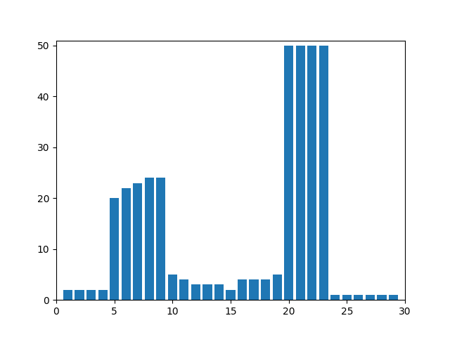| 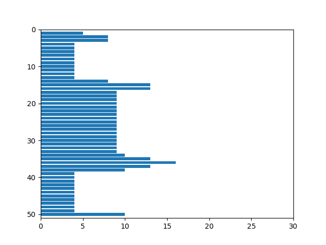|

|Признак|Значение|
|-------|--------|
|Вес чёрного|364|
|Нормированный вес чёрного|0.25103448275862067|
|Центр масс|(15, 25)|
|Нормированный центр масс|(0.5, 0.4897959183673469)|
|Моменты инерции|(59157, 18076)|
|Нормированные моменты инерции|(17.706375336725532, 5.410356180784197)|

### Буква Տ
|Символ|Профиль по х|Профиль по y|
|---------------------|--------------------------|--------------------------|
|| 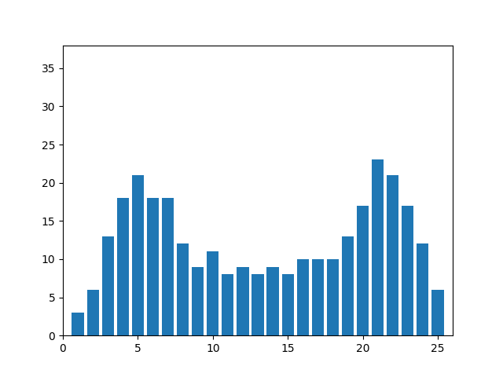| 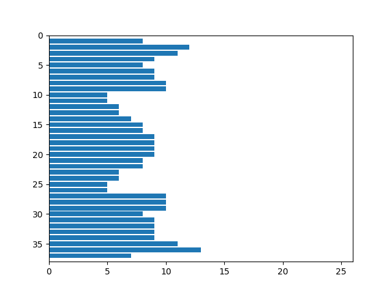|

|Признак|Значение|
|-------|--------|
|Вес чёрного|310|
|Нормированный вес чёрного|0.33513513513513515|
|Центр масс|(12, 18)|
|Нормированный центр масс|(0.4583333333333333, 0.4722222222222222)|
|Моменты инерции|(38800, 16405)|
|Нормированные моменты инерции|(19.45837512537613, 8.227181544633902)|

### Буква տ
|Символ|Профиль по х|Профиль по y|
|---------------------|--------------------------|--------------------------|
|| 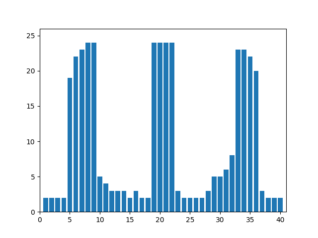| 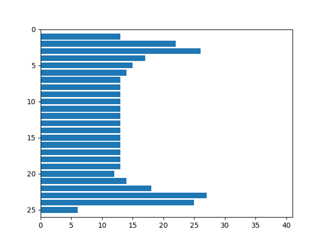|

|Признак|Значение|
|-------|--------|
|Вес чёрного|378|
|Нормированный вес чёрного|0.378|
|Центр масс|(19, 12)|
|Нормированный центр масс|(0.46153846153846156, 0.4583333333333333)|
|Моменты инерции|(22054, 47589)|
|Нормированные моменты инерции|(9.91191011235955, 21.388314606741574)|

### Буква Ր
|Символ|Профиль по х|Профиль по y|
|---------------------|--------------------------|--------------------------|
|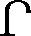| 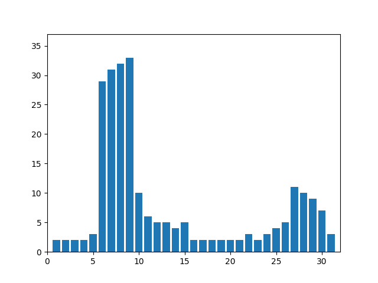| 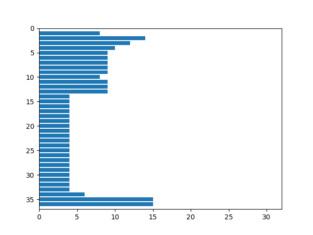|

|Признак|Значение|
|-------|--------|
|Вес чёрного|240|
|Нормированный вес чёрного|0.21505376344086022|
|Центр масс|(12, 16)|
|Нормированный центр масс|(0.36666666666666664, 0.42857142857142855)|
|Моменты инерции|(32964, 17422)|
|Нормированные моменты инерции|(14.60522817899867, 7.719096145325653)|

### Буква ր
|Символ|Профиль по х|Профиль по y|
|---------------------|--------------------------|--------------------------|
|| 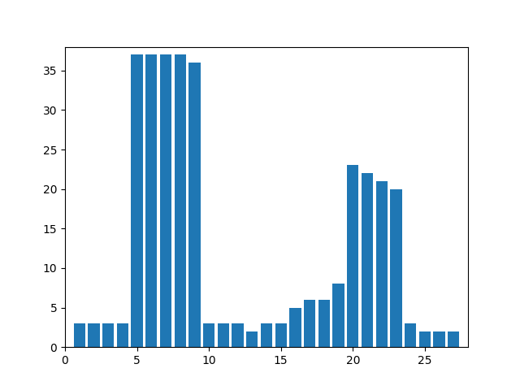| |

|Признак|Значение|
|-------|--------|
|Вес чёрного|333|
|Нормированный вес чёрного|0.3333333333333333|
|Центр масс|(11, 15)|
|Нормированный центр масс|(0.38461538461538464, 0.3888888888888889)|
|Моменты инерции|(37372, 16364)|
|Нормированные моменты инерции|(17.813155386081984, 7.799809342230696)|

### Буква Ց
|Символ|Профиль по х|Профиль по y|
|---------------------|--------------------------|--------------------------|
|| 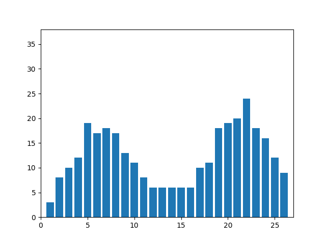| 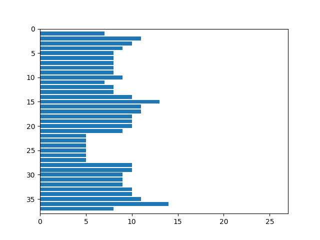|

|Признак|Значение|
|-------|--------|
|Вес чёрного|323|
|Нормированный вес чёрного|0.33575883575883575|
|Центр масс|(13, 18)|
|Нормированный центр масс|(0.48, 0.4722222222222222)|
|Моменты инерции|(38761, 18545)|
|Нормированные моменты инерции|(18.95403422982885, 9.06845965770171)|

### Буква ց
|Символ|Профиль по х|Профиль по y|
|---------------------|--------------------------|--------------------------|
|| 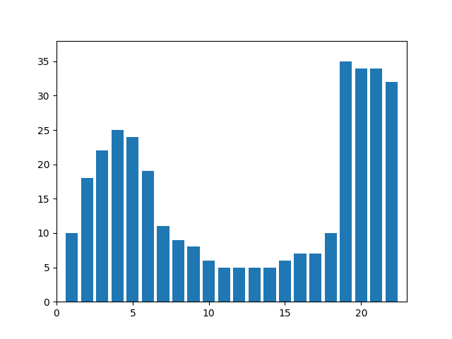| 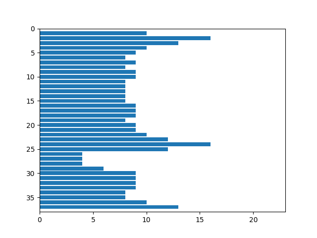|

|Признак|Значение|
|-------|--------|
|Вес чёрного|337|
|Нормированный вес чёрного|0.414004914004914|
|Центр масс|(12, 17)|
|Нормированный центр масс|(0.5238095238095238, 0.4444444444444444)|
|Моменты инерции|(41217, 19286)|
|Нормированные моменты инерции|(22.24338909875877, 10.407987048030222)|

### Буква Ւ
|Символ|Профиль по х|Профиль по y|
|---------------------|--------------------------|--------------------------|
|| 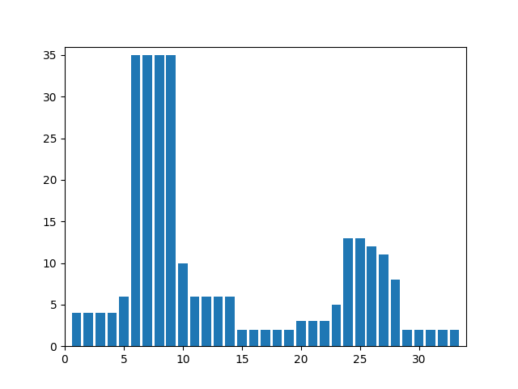| 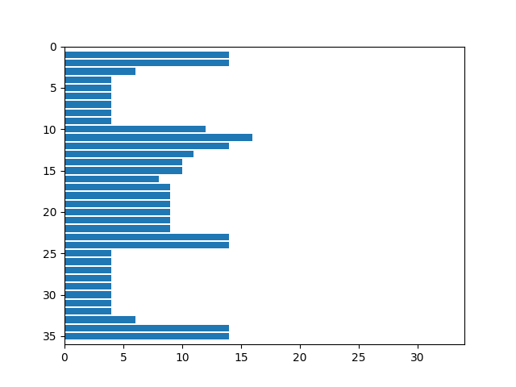|

|Признак|Значение|
|-------|--------|
|Вес чёрного|287|
|Нормированный вес чёрного|0.24848484848484848|
|Центр масс|(12, 17)|
|Нормированный центр масс|(0.34375, 0.47058823529411764)|
|Моменты инерции|(28646, 20655)|
|Нормированные моменты инерции|(12.37942955920484, 8.92610198789974)|

### Буква ւ
|Символ|Профиль по х|Профиль по y|
|---------------------|--------------------------|--------------------------|
|| 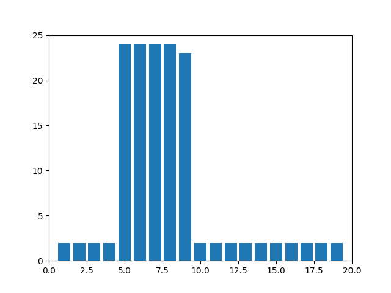| 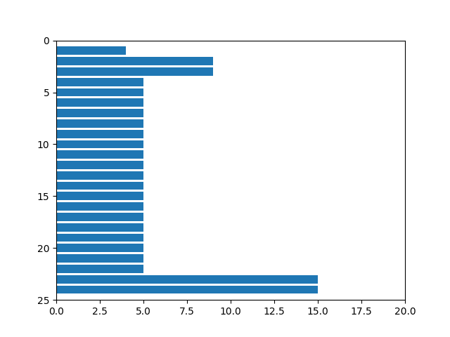|

|Признак|Значение|
|-------|--------|
|Вес чёрного|147|
|Нормированный вес чёрного|0.3223684210526316|
|Центр масс|(7, 13)|
|Нормированный центр масс|(0.3333333333333333, 0.5217391304347826)|
|Моменты инерции|(8721, 1621)|
|Нормированные моменты инерции|(9.30736392742796, 1.7299893276414087)|

### Буква Փ
|Символ|Профиль по х|Профиль по y|
|---------------------|--------------------------|--------------------------|
|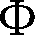| 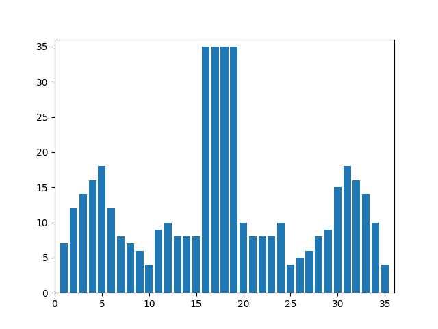| 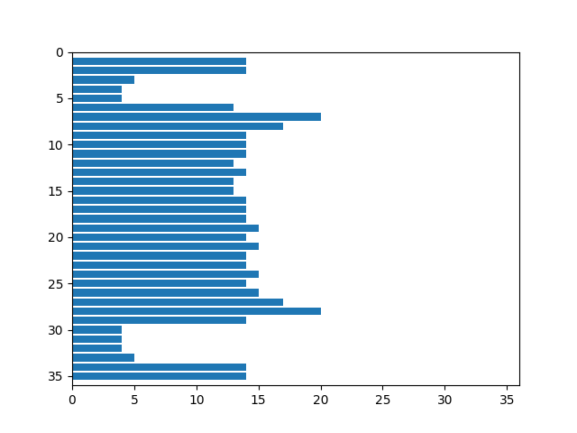|

|Признак|Значение|
|-------|--------|
|Вес чёрного|440|
|Нормированный вес чёрного|0.35918367346938773|
|Центр масс|(17, 17)|
|Нормированный центр масс|(0.47058823529411764, 0.47058823529411764)|
|Моменты инерции|(38964, 38867)|
|Нормированные моменты инерции|(15.903673469387755, 15.864081632653061)|

### Буква փ
|Символ|Профиль по х|Профиль по y|
|---------------------|--------------------------|--------------------------|
|| 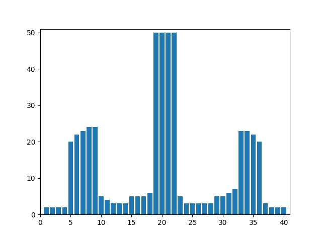| 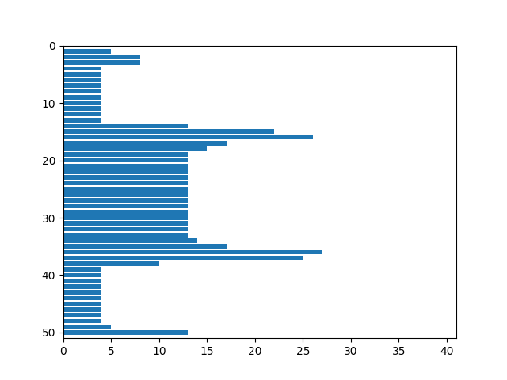|

|Признак|Значение|
|-------|--------|
|Вес чёрного|500|
|Нормированный вес чёрного|0.25|
|Центр масс|(19, 25)|
|Нормированный центр масс|(0.46153846153846156, 0.4897959183673469)|
|Моменты инерции|(69807, 48120)|
|Нормированные моменты инерции|(17.02609756097561, 11.736585365853658)|

### Буква Ք
|Символ|Профиль по х|Профиль по y|
|---------------------|--------------------------|--------------------------|
|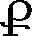| 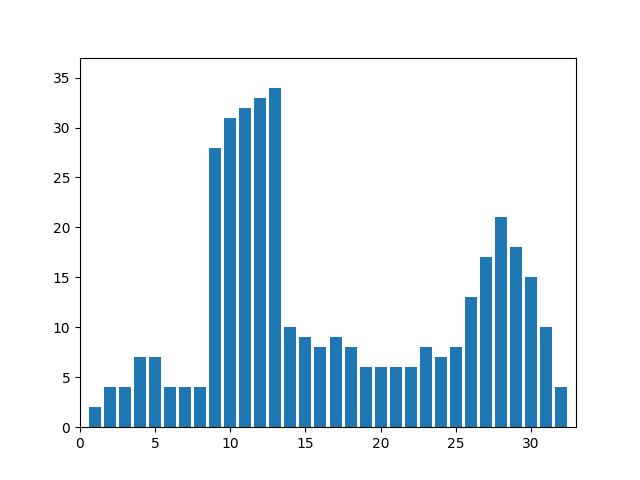| 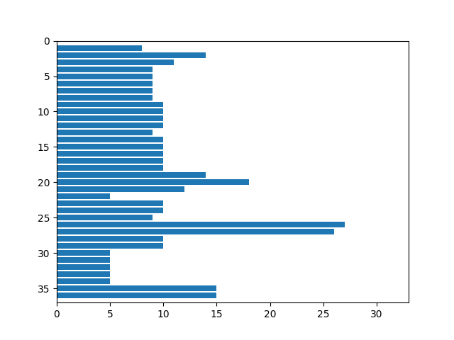|

|Признак|Значение|
|-------|--------|
|Вес чёрного|383|
|Нормированный вес чёрного|0.3324652777777778|
|Центр масс|(16, 18)|
|Нормированный центр масс|(0.4838709677419355, 0.4857142857142857)|
|Моменты инерции|(39055, 26317)|
|Нормированные моменты инерции|(16.834051724137932, 11.34353448275862)|

### Буква ք
|Символ|Профиль по х|Профиль по y|
|---------------------|--------------------------|--------------------------|
|| 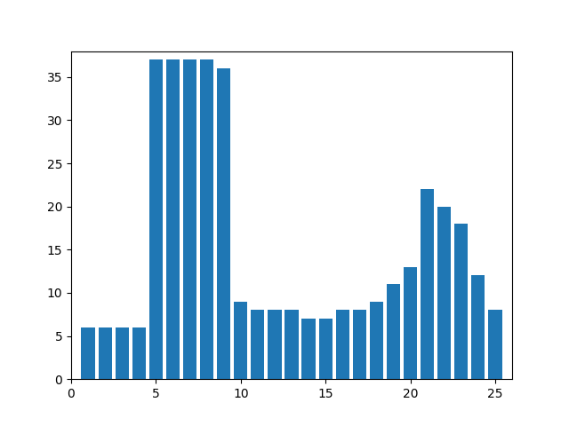| 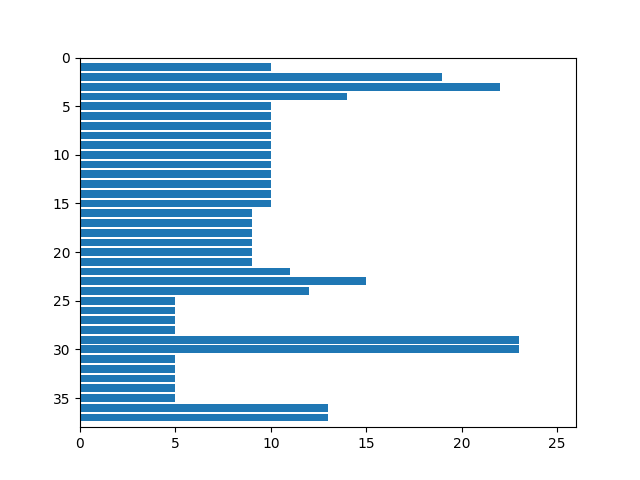|

|Признак|Значение|
|-------|--------|
|Вес чёрного|384|
|Нормированный вес чёрного|0.4151351351351351|
|Центр масс|(11, 17)|
|Нормированный центр масс|(0.4166666666666667, 0.4444444444444444)|
|Моменты инерции|(46887, 18388)|
|Нормированные моменты инерции|(23.514042126379138, 9.221664994984955)|

### Буква Օ
|Символ|Профиль по х|Профиль по y|
|---------------------|--------------------------|--------------------------|
|| 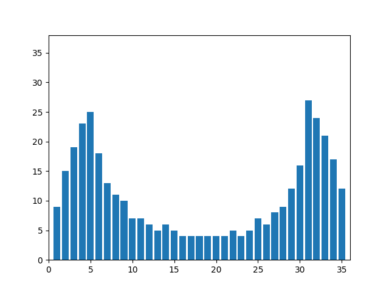| 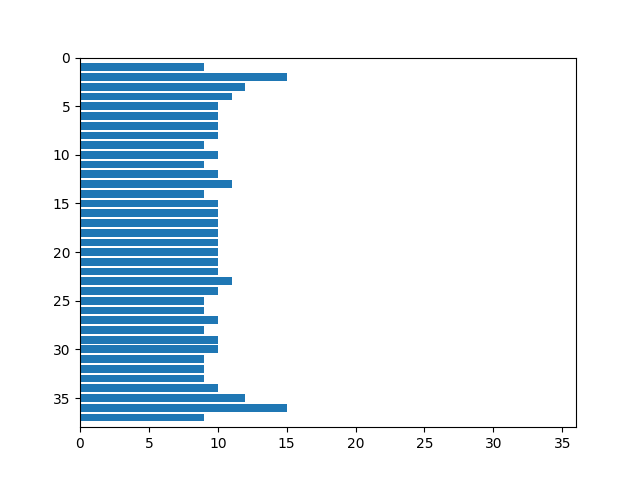|

|Признак|Значение|
|-------|--------|
|Вес чёрного|376|
|Нормированный вес чёрного|0.29034749034749036|
|Центр масс|(17, 18)|
|Нормированный центр масс|(0.47058823529411764, 0.4722222222222222)|
|Моменты инерции|(44859, 55076)|
|Нормированные моменты инерции|(17.29336931380108, 21.23207401696222)|

### Буква օ
|Символ|Профиль по х|Профиль по y|
|---------------------|--------------------------|--------------------------|
|| 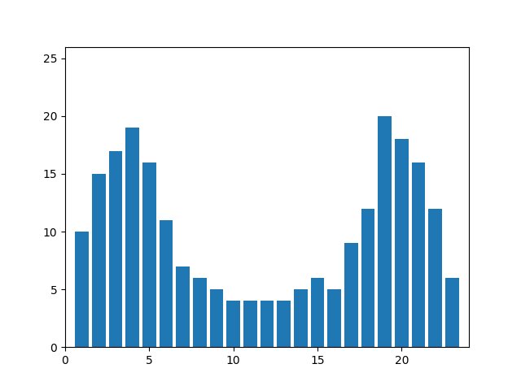| 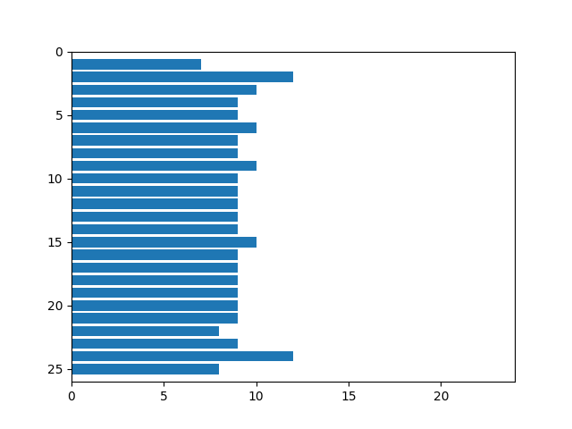|

|Признак|Значение|
|-------|--------|
|Вес чёрного|231|
|Нормированный вес чёрного|0.4017391304347826|
|Центр масс|(11, 12)|
|Нормированный центр масс|(0.45454545454545453, 0.4583333333333333)|
|Моменты инерции|(12082, 12988)|
|Нормированные моменты инерции|(10.469670710571924, 11.25476603119584)|

### Буква Ֆ
|Символ|Профиль по х|Профиль по y|
|---------------------|--------------------------|--------------------------|
|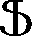| 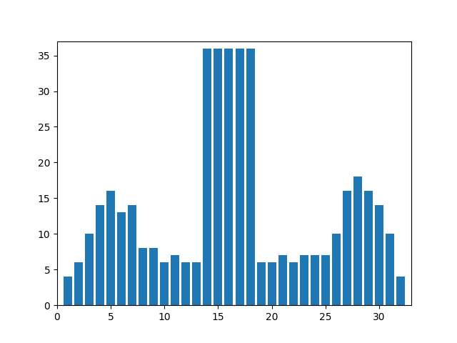| 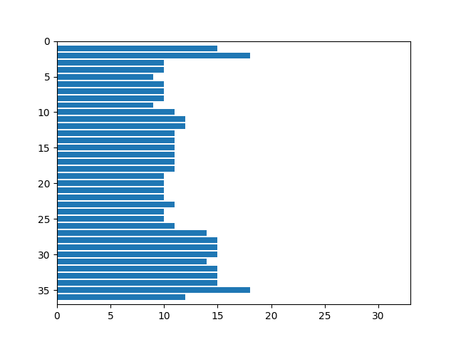|

|Признак|Значение|
|-------|--------|
|Вес чёрного|432|
|Нормированный вес чёрного|0.375|
|Центр масс|(16, 18)|
|Нормированный центр масс|(0.4838709677419355, 0.4857142857142857)|
|Моменты инерции|(50957, 27970)|
|Нормированные моменты инерции|(21.964224137931033, 12.056034482758621)|

### Буква ֆ
|Символ|Профиль по х|Профиль по y|
|---------------------|--------------------------|--------------------------|
|| 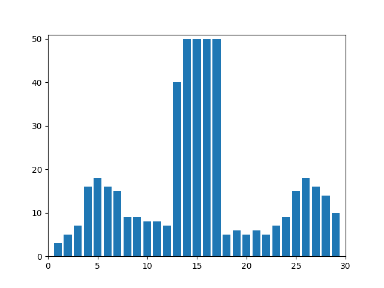| 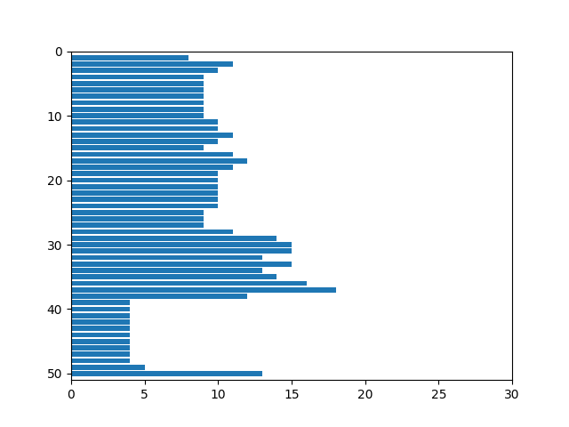|

|Признак|Значение|
|-------|--------|
|Вес чёрного|477|
|Нормированный вес чёрного|0.3289655172413793|
|Центр масс|(14, 23)|
|Нормированный центр масс|(0.4642857142857143, 0.4489795918367347)|
|Моменты инерции|(82972, 22261)|
|Нормированные моменты инерции|(24.834480694402874, 6.662975157138582)|
