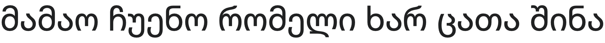
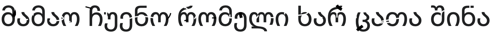

# Лабораторная работа №6

## Тема: Классификациянаосновепризнаков,анализпрофилей

|**Студент:**|*Долидзе Александра*|
|------------|--------------|
|**Группа:** |*Б18-514*     |
|**Вариант:**|*Грузинский алфавит*|

### Строки

Оригинал:

## Оценка близости для размера шрифта 52

### Буква 0

## Лучшие гипотезы: 

| Буква | Близость |
| :---: | :---: |
|ა|97.94245566411816|
|ი|94.66011754671683|
|ო|93.01058859148775|
|რ|91.58784962942784|
|პ|91.58605904079549|
|ჰ|91.29059882252743|
|ს|91.25977984562557|
|კ|90.67815223682939|
|თ|90.15597722886662|
|ხ|89.65225392726428|
|ძ|89.3779199969629|
|ზ|88.97966604874111|
|ჩ|87.77314000106132|
|ც|87.56236656843856|
|ჟ|87.55947485762954|
|გ|87.15462203812542|
|ბ|86.79414498195473|
|ყ|86.43684623141888|
|ე|86.11950750038862|
|მ|85.9337245015403|
|ვ|85.33855227314491|
|ქ|85.10922645498421|
|ლ|84.90359631931771|
|ღ|84.87209712163386|
|ნ|84.8172009397726|
|ჯ|83.96680726237514|
|შ|83.6214803179081|
|დ|83.39092790848724|
|ჭ|83.35723451202875|
|ტ|83.00430524170483|
|უ|80.4269325907693|
|ფ|80.28829080267475|
|წ|79.68347167362073|

### Буква 1

## Лучшие гипотезы: 

| Буква | Близость |
| :---: | :---: |
|ა|38.486161534615135|
|ი|33.95961911755743|
|ჰ|33.22095488474592|
|პ|32.73233882588013|
|ო|32.08531552280866|
|ს|32.05466896309979|
|კ|31.973460593185774|
|რ|30.793000424529207|
|ძ|30.07398838660076|
|ხ|29.974353385616297|
|თ|29.796977827661422|
|ჩ|28.806999088042712|
|ჟ|28.707958339666135|
|ზ|28.380251207785705|
|გ|28.28164911104669|
|ქ|28.080157357133725|
|ბ|27.789356690339083|
|ყ|27.620628478944145|
|ე|27.56600530195019|
|ც|27.479719779966317|
|ჭ|26.98816599231991|
|მ|26.87898993240105|
|ვ|26.873544265212633|
|ნ|26.013710245505294|
|შ|24.84904312750791|
|ღ|24.437141798110275|
|ჯ|24.204368995119108|
|ლ|24.09655095210345|
|წ|23.625769298897414|
|დ|22.463092765176008|
|ტ|22.409530973242084|
|ფ|19.782334552463407|
|უ|19.604768556304343|

### Буква 2

## Лучшие гипотезы: 

| Буква | Близость |
| :---: | :---: |
|ა|99.81691519842488|
|ი|96.8993575036946|
|ო|95.51915603154795|
|რ|93.8849069230474|
|პ|93.39267949561618|
|ს|93.13041399442234|
|ჰ|92.9766095395566|
|თ|92.93124461408703|
|კ|92.4677851526226|
|ხ|91.62543614172152|
|ძ|91.28102576597482|
|ზ|91.1972462431645|
|ც|89.63811363568165|
|ჩ|89.6313325059801|
|ჟ|89.40077885105197|
|გ|89.00321181891361|
|ბ|88.66752954753008|
|ყ|88.28319730618873|
|ე|87.92865037590778|
|მ|87.82326377705185|
|ლ|87.51143963635299|
|ვ|87.14282413748978|
|ღ|87.0557055909017|
|ქ|86.7250925870298|
|ნ|86.67777291680235|
|ჯ|85.99968631132323|
|დ|85.89920527424253|
|შ|85.48981759215778|
|ტ|85.24760693244227|
|ჭ|84.91984353431474|
|უ|82.77580173293157|
|ფ|82.51910537376621|
|წ|81.27181327473369|

### Буква 3

## Лучшие гипотезы: 

| Буква | Близость |
| :---: | :---: |
|ა|37.52609866729826|
|ი|33.29625218431289|
|ჰ|32.06128897296655|
|ო|31.70637259752702|
|პ|31.6624959689619|
|ს|31.03118799920899|
|კ|30.88051812606306|
|რ|30.176998498741565|
|თ|29.752209205987164|
|ძ|29.056505279865544|
|ხ|29.021029032845885|
|ჩ|27.731977090729735|
|ზ|27.66463954150581|
|ჟ|27.616437618911103|
|გ|27.190440652085677|
|ქ|26.79046823366782|
|ბ|26.713901420784115|
|ც|26.60237614078251|
|ყ|26.517626121739397|
|ე|26.428303803058135|
|მ|25.805369706628174|
|ვ|25.720142162094053|
|ჭ|25.638660433890024|
|ნ|24.898322576103556|
|ლ|23.871396892106585|
|შ|23.72109805260941|
|ღ|23.650084916567877|
|ჯ|23.238903915574834|
|წ|22.225035873761534|
|დ|22.101493826919086|
|ტ|21.677968533532233|
|ფ|19.004770806028194|
|უ|19.000386684102725|

### Буква 4

## Лучшие гипотезы: 

| Буква | Близость |
| :---: | :---: |
|ა|82.34117042576736|
|ჰ|80.34124905457332|
|პ|78.80134086576786|
|კ|78.4202832719502|
|ს|77.63769280274983|
|ქ|77.15233650355829|
|ჭ|76.75318489636298|
|ძ|75.87149011259608|
|ჟ|75.55467035899345|
|ჩ|75.45172819032712|
|გ|75.18030778742701|
|ე|75.0686455102922|
|ხ|75.01989989787815|
|ყ|74.73871779864524|
|ვ|74.62860290944111|
|ბ|74.58084498212297|
|ი|74.43062673665595|
|წ|74.0830062238409|
|მ|73.7808268757828|
|ნ|73.47867506497357|
|შ|72.60135970673181|
|ც|72.08803824881635|
|რ|71.38900494374664|
|ზ|70.86417604224177|
|ჯ|70.41069653638243|
|ო|68.99250590123226|
|ღ|68.71618547681133|
|ტ|66.63946250345786|
|ფ|65.19650054392497|
|უ|63.46671934597056|
|დ|62.71689921937942|
|თ|62.6161218103378|
|ლ|62.029101915342025|

### Буква 5

## Лучшие гипотезы: 

| Буква | Близость |
| :---: | :---: |
|ა|77.67276381164193|
|ი|74.00258828960898|
|ო|72.17690309675285|
|პ|71.43057353899526|
|ჰ|71.3159599479737|
|ს|71.0172205205631|
|რ|70.88766900557697|
|კ|70.55066224865935|
|ხ|69.28334317912109|
|თ|69.25780836992415|
|ძ|69.09900583369428|
|ზ|68.35097059150998|
|ჩ|67.56115629557743|
|ჟ|67.37166498786169|
|ც|67.07997317243607|
|გ|66.95841210818847|
|ბ|66.56522394424198|
|ყ|66.24684379728478|
|ე|65.98392087883526|
|მ|65.68630603443985|
|ქ|65.28198452083001|
|ვ|65.21376716385738|
|ნ|64.61453139552425|
|ღ|64.28426300822048|
|ლ|64.03529816329524|
|ჭ|63.633157014406464|
|ჯ|63.544542103198|
|შ|63.41321679139584|
|დ|62.56449575196613|
|ტ|62.36465442389199|
|წ|59.941408797333985|
|უ|59.70447692308563|
|ფ|59.66645286222124|

### Буква 6

## Лучшие гипотезы: 

| Буква | Близость |
| :---: | :---: |
|ა|93.92071288846397|
|ი|91.36714937175769|
|ო|90.29215640753199|
|რ|88.42156585017801|
|თ|88.04524837381841|
|პ|87.4473701792997|
|ს|87.24318700635418|
|ჰ|86.92793588765821|
|კ|86.50926231050585|
|ხ|85.83698490875601|
|ზ|85.65510694058347|
|ძ|85.42747210561143|
|ც|83.95420503638202|
|ჩ|83.74018892841401|
|ჟ|83.49473011140427|
|გ|83.10463548407765|
|ბ|82.79234079787776|
|ლ|82.4266681809171|
|ყ|82.38420195527259|
|ე|81.99690246288144|
|მ|81.96484187172703|
|ღ|81.4884175468141|
|ვ|81.20848934391545|
|ნ|80.79542124558|
|დ|80.69820145820276|
|ქ|80.63038030790702|
|ჯ|80.28226055440643|
|ტ|79.74846926868545|
|შ|79.6173323276224|
|ჭ|78.7856586981498|
|უ|77.39990102648296|
|ფ|77.01461613489006|
|წ|75.16668681217703|

### Буква 7

## Лучшие гипотезы: 

| Буква | Близость |
| :---: | :---: |
|ა|87.54806706215477|
|ი|84.95388223656845|
|ო|83.88546800094112|
|რ|82.00687094088752|
|თ|81.67992418621714|
|პ|81.08426480705295|
|ს|80.86783404902216|
|ჰ|80.59135696289202|
|კ|80.14904027388536|
|ხ|79.44495438150165|
|ზ|79.24193678868892|
|ძ|79.04570331758862|
|ც|77.54976326383044|
|ჩ|77.36507724220158|
|ჟ|77.12258410215199|
|გ|76.73086489821726|
|ბ|76.41403661879002|
|ლ|76.03467666680488|
|ყ|76.01043437592455|
|ე|75.62988354420462|
|მ|75.58339999245476|
|ღ|75.07603434516888|
|ვ|74.8418826215975|
|ნ|74.41812538566272|
|ქ|74.30671842423747|
|დ|74.29476643459381|
|ჯ|73.88075335548484|
|ტ|73.33404290721136|
|შ|73.23805672505199|
|ჭ|72.47486251101736|
|უ|70.98661221811514|
|ფ|70.60026962767684|
|წ|68.8452263821901|

### Буква 8

## Лучшие гипотезы: 

| Буква | Близость |
| :---: | :---: |
|ა|97.80818258172778|
|ი|95.19544613516454|
|ო|94.05560714852741|
|რ|92.23572063941334|
|თ|91.72329071917689|
|პ|91.34045958093071|
|ს|91.12877509572525|
|ჰ|90.83203942307418|
|კ|90.40382072334613|
|ხ|89.70845014817051|
|ზ|89.48428307087474|
|ძ|89.30843308113855|
|ც|87.80864567635022|
|ჩ|87.62575096041382|
|ჟ|87.3825175874963|
|გ|86.99120516853574|
|ბ|86.67575623350642|
|ყ|86.2708282972766|
|ლ|86.15391445857989|
|ე|85.8877269685873|
|მ|85.84596771988632|
|ღ|85.32150755213118|
|ვ|85.09950487049726|
|ნ|84.67949614641616|
|ქ|84.5382110396452|
|დ|84.4530903501576|
|ჯ|84.14170691000474|
|ტ|83.56800018946288|
|შ|83.50015870086665|
|ჭ|82.69638530457772|
|უ|81.19341436467288|
|ფ|80.83463217619588|
|წ|79.07474143685114|

### Буква 9

## Лучшие гипотезы: 

| Буква | Близость |
| :---: | :---: |
|ა|82.43998351871531|
|ჰ|80.95451821506762|
|პ|79.2826116609099|
|კ|78.96503849527375|
|ქ|78.15083793745936|
|ს|78.07230501812317|
|ჭ|77.89141524608384|
|ძ|76.37457384235358|
|ჟ|76.21695216110993|
|ჩ|76.08621492691069|
|გ|75.85816236231426|
|ე|75.84077064601699|
|ყ|75.45884334336534|
|ვ|75.44907731636002|
|ხ|75.4382995948437|
|წ|75.4068993467858|
|ბ|75.25566113597655|
|მ|74.48951149221017|
|ი|74.28781276371187|
|ნ|74.27820565381678|
|შ|73.4638897131406|
|ც|72.52257550045508|
|რ|71.35191798733946|
|ჯ|71.10294664172825|
|ზ|71.06807236522283|
|ღ|69.20735697851514|
|ო|68.62050571330359|
|ტ|67.19317453945358|
|ფ|65.9458217243952|
|უ|64.0965199184538|
|დ|62.97436766267303|
|თ|62.08223489957165|
|ლ|62.06837822720767|

### Буква 10

## Лучшие гипотезы: 

| Буква | Близость |
| :---: | :---: |
|ა|85.27629778818131|
|ჰ|81.03016639783816|
|პ|80.19881447953325|
|კ|79.54828499170846|
|ს|79.32441540347685|
|ი|78.9347432499303|
|ძ|77.36056064496034|
|ხ|76.95647655101688|
|ჩ|76.36096901135069|
|ჟ|76.32788896038095|
|ქ|76.2322417512118|
|გ|75.90663612012676|
|რ|75.63636985422963|
|ბ|75.36371464978284|
|ე|75.36254023854839|
|ყ|75.29927222951187|
|ჭ|75.19148953423029|
|ო|74.88199204623423|
|ვ|74.72675729959052|
|მ|74.46365786379074|
|ც|74.16126392926193|
|ზ|74.07498558703536|
|ნ|73.75850419540447|
|შ|72.65117567235554|
|წ|71.81432566543408|
|ჯ|71.42598095933242|
|ღ|70.79434748412936|
|თ|69.70681051409204|
|ტ|68.60710677686667|
|ლ|66.71621590876657|
|ფ|66.39386369002165|
|დ|66.37771153199239|
|უ|65.37696315064264|

### Буква 11

## Лучшие гипотезы: 

| Буква | Близость |
| :---: | :---: |
|ა|92.23863125248393|
|ჰ|90.50258196784618|
|პ|88.90115897111535|
|კ|88.54967310830074|
|ს|87.7141685839331|
|ქ|87.45924710835536|
|ჭ|87.10232547824168|
|ძ|85.97985394978149|
|ჟ|85.73433348055845|
|ჩ|85.61935591788749|
|გ|85.36634654313399|
|ე|85.29302888518534|
|ხ|85.08667775978664|
|ყ|84.94200559764056|
|ვ|84.87139228002677|
|ბ|84.76519965292199|
|წ|84.47797661718414|
|ი|84.17265196430118|
|მ|83.97879774674522|
|ნ|83.7126934133092|
|შ|82.85854930646262|
|ც|82.16078599865985|
|რ|81.19706082790448|
|ზ|80.81481158227612|
|ჯ|80.599588240165|
|ღ|78.81386164311584|
|ო|78.57283648453493|
|ტ|76.76471370773041|
|ფ|75.404754629066|
|უ|73.62332509171372|
|დ|72.69023984629347|
|თ|72.07171977081943|
|ლ|71.87667193232257|

### Буква 12

## Лучшие гипотезы: 

| Буква | Близость |
| :---: | :---: |
|ა|98.76391848853841|
|ი|96.00378217946356|
|ო|94.74793275175448|
|რ|93.01714056465977|
|პ|92.3160700625748|
|თ|92.29208563905995|
|ს|92.07997638013738|
|ჰ|91.85215347461178|
|კ|91.38493390669777|
|ხ|90.61852950388256|
|ზ|90.29588365403346|
|ძ|90.24524819851129|
|ც|88.67610966993405|
|ჩ|88.57822215655756|
|ჟ|88.34100101700407|
|გ|87.94663580703488|
|ბ|87.62135483388658|
|ყ|87.22627020814107|
|ე|86.85686800298944|
|ლ|86.79347002715575|
|მ|86.78438406703549|
|ღ|86.14246639169214|
|ვ|86.06965196904318|
|ნ|85.62783710769901|
|ქ|85.57759857765087|
|დ|85.13490321314028|
|ჯ|85.02214731160709|
|შ|84.44403719025901|
|ტ|84.36221389467997|
|ჭ|83.75311666449802|
|უ|81.94010757095809|
|ფ|81.63050833281564|
|წ|80.11796129838802|

### Буква 13

## Лучшие гипотезы: 

| Буква | Близость |
| :---: | :---: |
|ა|97.37326924848723|
|ი|94.90973545789167|
|ო|93.88437245959265|
|რ|91.97783399678293|
|თ|91.6718919747846|
|პ|90.88706517465832|
|ს|90.70073120461203|
|ჰ|90.33301545824342|
|კ|89.94510625342969|
|ხ|89.32268211424203|
|ზ|89.19736675680737|
|ძ|88.8954654888602|
|ც|87.46654261055373|
|ჩ|87.197790952002|
|ჟ|86.948075676666|
|გ|86.56035870141251|
|ბ|86.25506167238349|
|ლ|86.03697355826608|
|ყ|85.84008103402799|
|ე|85.44302045435929|
|მ|85.4327530645937|
|ღ|85.02692563683614|
|ვ|84.65413060427252|
|დ|84.2957679084526|
|ნ|84.25684875105156|
|ქ|84.0213759138528|
|ჯ|83.78800862424666|
|ტ|83.30075509261431|
|შ|83.08221304427903|
|ჭ|82.16238666982447|
|უ|80.97398225768444|
|ფ|80.5667959210979|
|წ|78.556475007819|

### Буква 14

## Лучшие гипотезы: 

| Буква | Близость |
| :---: | :---: |
|ა|123.97034692859607|
|ჰ|121.20143446978292|
|პ|119.90185322112234|
|კ|119.41980409701588|
|ს|118.82432690218825|
|ქ|117.30793506889935|
|ძ|116.96757319468188|
|ჭ|116.61005022598509|
|ი|116.38637470677041|
|ჟ|116.38516615621892|
|ჩ|116.33198181605276|
|ხ|116.25815899829132|
|გ|115.98776397252897|
|ე|115.70594265774719|
|ყ|115.47621730886195|
|ბ|115.40145121709666|
|ვ|115.18082109876134|
|მ|114.55182491161088|
|ნ|114.08716486994416|
|წ|113.55789593506374|
|ც|113.3327021935133|
|რ|113.25222868503772|
|შ|113.1034642807099|
|ზ|112.4449124894299|
|ჯ|111.25696102531995|
|ო|111.17959808411086|
|ღ|109.91339947459812|
|ტ|107.7662685364899|
|ფ|106.02281045398828|
|თ|104.93867432369962|
|უ|104.5184905397327|
|დ|104.30901625795303|
|ლ|103.88103420332997|

### Буква 15

## Лучшие гипотезы: 

| Буква | Близость |
| :---: | :---: |
|ა|55.85811053820879|
|ჰ|51.815468601554386|
|პ|50.87570462695679|
|კ|50.255845534196844|
|ს|49.96568300812785|
|ი|49.58908036833841|
|ძ|48.01176329123872|
|ხ|47.56682734108801|
|ქ|47.3334988271259|
|ჩ|47.07772242174087|
|ჟ|47.06459882698369|
|გ|46.64744933619967|
|ჭ|46.473584076505276|
|რ|46.28573979095333|
|ე|46.172720922559336|
|ბ|46.09170359499628|
|ყ|46.061840548210924|
|ო|45.80948815954255|
|ვ|45.56876957706741|
|მ|45.199880464030585|
|ც|44.75409482350372|
|ზ|44.65965668930504|
|ნ|44.55669692463971|
|შ|43.48241503440083|
|წ|43.29720268528332|
|ჯ|42.09426941800667|
|ღ|41.37819135806379|
|თ|41.10317223589336|
|ტ|39.18984768508565|
|ლ|37.53290479946173|
|დ|37.039197541788624|
|ფ|37.01126267390819|
|უ|35.955221866195735|

### Буква 16

## Лучшие гипотезы: 

| Буква | Близость |
| :---: | :---: |
|ა|67.53427378899192|
|ი|63.56693132989321|
|ო|61.59715995615182|
|ჰ|61.4254091638968|
|პ|61.39812231392353|
|ს|60.91718220300921|
|კ|60.543217475455485|
|რ|60.42021773920403|
|ხ|59.08743147109893|
|ძ|58.97588593444033|
|თ|58.61709633079411|
|ზ|57.94564212037658|
|ჩ|57.496369955239125|
|ჟ|57.32741514901577|
|გ|56.90859679054433|
|ც|56.79714754821193|
|ბ|56.4903111788723|
|ყ|56.20478951165054|
|ე|55.98715067888731|
|მ|55.599621574530914|
|ქ|55.53692142452517|
|ვ|55.228865566114024|
|ნ|54.56812511137359|
|ჭ|53.9810759972533|
|ღ|53.91966195491016|
|ლ|53.42684769674034|
|შ|53.36741852576154|
|ჯ|53.32052286064095|
|დ|51.99514825928139|
|ტ|51.9591288453679|
|წ|50.30030201062947|
|ფ|49.28151510752083|
|უ|49.230901420051104|

### Буква 17

## Лучшие гипотезы: 

| Буква | Близость |
| :---: | :---: |
|ა|38.75189706616898|
|ი|34.07788358938229|
|ჰ|33.596627443508645|
|პ|33.059338411764834|
|ს|32.35731794438671|
|კ|32.3133568826165|
|ო|32.06861118796669|
|რ|30.890604816841623|
|ძ|30.374864175976956|
|ხ|30.241721055783337|
|თ|29.62910415200448|
|ჩ|29.139309563819456|
|ჟ|29.049279136302765|
|გ|28.62306680415873|
|ქ|28.53244969193996|
|ზ|28.52892165844664|
|ბ|28.12271916236487|
|ყ|27.968936573528097|
|ე|27.933182105307004|
|ც|27.710258416123143|
|ჭ|27.476492433328485|
|ვ|27.2498267537217|
|მ|27.21216862720456|
|ნ|26.370004778283068|
|შ|25.213262073011425|
|ღ|24.625694763926873|
|ჯ|24.48356438073133|
|წ|24.14748076641366|
|ლ|24.0174500826362|
|ტ|22.57354050558634|
|დ|22.449877709295855|
|ფ|19.973677320184443|
|უ|19.71220745201189|

### Буква 18

## Лучшие гипотезы: 

| Буква | Близость |
| :---: | :---: |
|ა|96.56144280944163|
|ჰ|91.73253120619802|
|პ|91.13342655863207|
|ი|90.73723927741335|
|კ|90.4154429591861|
|ს|90.36189092077393|
|ძ|88.38066004150038|
|ხ|88.11429286601911|
|რ|87.43319522645439|
|ჩ|87.23067992176577|
|ჟ|87.15722608781871|
|ო|87.07371615869621|
|გ|86.73136532504441|
|ქ|86.52635791436003|
|ბ|86.21795274233736|
|ყ|86.08746743588678|
|ე|86.06719873985868|
|ზ|85.63929217265624|
|ც|85.41707271199678|
|ვ|85.3857007439486|
|მ|85.30857791981985|
|ჭ|85.29590501603965|
|ნ|84.49739410830809|
|შ|83.34642892352039|
|ჯ|82.44306434012803|
|თ|82.22922095675813|
|ღ|82.1275447797419|
|წ|81.76687793247557|
|ტ|79.96290514443287|
|ლ|78.79193662328458|
|დ|78.22159191786038|
|ფ|77.59381014075908|
|უ|76.80030133082953|

### Буква 19

## Лучшие гипотезы: 

| Буква | Близость |
| :---: | :---: |
|ა|95.53619674032686|
|ი|91.48230297327696|
|პ|89.37240814703456|
|ჰ|89.3379937438253|
|ო|89.24648392765936|
|ს|88.91074671442166|
|კ|88.50827246945374|
|რ|88.30444738248492|
|ხ|87.09387453882563|
|ძ|86.97373292437707|
|ზ|85.89172998579924|
|თ|85.80905284480133|
|ჩ|85.47956061163417|
|ჟ|85.3041672987364|
|გ|84.88711845652853|
|ც|84.79746763007516|
|ბ|84.47614639467703|
|ყ|84.18042848001986|
|ე|83.94625778324695|
|მ|83.58830940396632|
|ქ|83.35976205050572|
|ვ|83.18284428398125|
|ნ|82.54459736087699|
|ღ|81.89336024881919|
|ჭ|81.73799907899125|
|შ|81.34316564695038|
|ჯ|81.32721043524052|
|ლ|80.97656373412042|
|ტ|79.91025693411181|
|დ|79.70138582651465|
|წ|78.04676959555695|
|ფ|77.24755589820563|
|უ|77.12202429280592|

### Буква 20

## Лучшие гипотезы: 

| Буква | Близость |
| :---: | :---: |
|ა|35.39377645702008|
|ი|31.464977050351603|
|ო|30.209894986925|
|ჰ|29.775762493300604|
|პ|29.443965093333134|
|ს|28.851316319211396|
|თ|28.695706161547825|
|კ|28.644683499011126|
|რ|28.40606859087862|
|ხ|26.90583267691054|
|ძ|26.884422144186193|
|ზ|25.791180998264835|
|ჩ|25.513926423651245|
|ჟ|25.38542008262127|
|გ|24.960168353668966|
|ც|24.564394030814|
|ბ|24.49690232070813|
|ქ|24.430990044610052|
|ყ|24.27904558748382|
|ე|24.16351257851443|
|მ|23.59125849777496|
|ვ|23.444734722914664|
|ჭ|23.25464040895425|
|ნ|22.652390200588744|
|ლ|22.60788603588884|
|ღ|21.71372300057187|
|შ|21.467326420678624|
|ჯ|21.125041126695407|
|დ|20.674089764164396|
|წ|19.828075452591207|
|ტ|19.81047425897999|
|უ|17.296775699321827|
|ფ|17.101435980414706|

### Буква 21

## Лучшие гипотезы: 

| Буква | Близость |
| :---: | :---: |
|ა|99.54448674780649|
|ჰ|97.5471083992747|
|პ|96.01866628430349|
|კ|95.63343515307409|
|ს|94.85701023450396|
|ქ|94.27952825897488|
|ჭ|93.8337732221588|
|ძ|93.08806799922458|
|ჟ|92.75604541090287|
|ჩ|92.65668726665494|
|გ|92.37968254020096|
|ე|92.25266466250243|
|ხ|92.239768377195|
|ყ|91.93194444727355|
|ვ|91.80332753345866|
|ბ|91.78090602987352|
|ი|91.58611479581916|
|წ|91.0901431430506|
|მ|90.97631354604718|
|ნ|90.65838723353602|
|შ|89.7683905577045|
|ც|89.30773619305226|
|რ|88.56641792678933|
|ზ|88.07597311880411|
|ჯ|87.61015594787474|
|ო|86.07596051059427|
|ღ|85.9344920523119|
|ტ|83.85464616100022|
|ფ|82.3903737411965|
|უ|80.67663695573832|
|დ|79.93103438302875|
|თ|79.63085555585148|
|ლ|79.21594085345635|

### Буква 22

## Лучшие гипотезы: 

| Буква | Близость |
| :---: | :---: |
|ა|38.91744551711797|
|ი|34.24958438308524|
|ჰ|33.75221389258538|
|პ|33.21992250816231|
|ს|32.52001673653292|
|კ|32.472703061156096|
|ო|32.23984673982757|
|რ|31.062597682931568|
|ძ|30.537665995996033|
|ხ|30.40704476410122|
|თ|29.793123410392774|
|ჩ|29.299303276425967|
|ჟ|29.20840761709913|
|გ|28.78217973640634|
|ზ|28.699906809828754|
|ქ|28.677678450960506|
|ბ|28.282594684478262|
|ყ|28.127336142564605|
|ე|28.08959049668685|
|ც|27.877829857228587|
|ჭ|27.615698043035415|
|ვ|27.40519323968455|
|მ|27.372037549260067|
|ნ|26.527530688461084|
|შ|25.369906140936447|
|ღ|24.795244408710637|
|ჯ|24.647928719572157|
|წ|24.28018148372763|
|ლ|24.186697452144827|
|ტ|22.74398376728582|
|დ|22.621283096021823|
|ფ|20.14300651885113|
|უ|19.88400146592079|

### Буква 23

## Лучшие гипотезы: 

| Буква | Близость |
| :---: | :---: |
|ა|107.64563369545787|
|ი|104.9216790257337|
|ო|103.65359844897792|
|რ|101.93526763520626|
|პ|101.18776156048682|
|თ|101.14907178781145|
|ს|100.96350329898573|
|ჰ|100.69766647285302|
|კ|100.25368531995738|
|ხ|99.51778874539505|
|ზ|99.21357423927238|
|ძ|99.13473243657502|
|ც|97.58655806722213|
|ჩ|97.46105786060167|
|ჟ|97.22096535975723|
|გ|96.82808227153474|
|ბ|96.50713722917864|
|ყ|96.1076362330033|
|ე|95.73164132919918|
|ლ|95.68337917591866|
|მ|95.67308856103921|
|ღ|95.05947537691158|
|ვ|94.94390134691692|
|ნ|94.5123538335986|
|ქ|94.40956267133845|
|დ|94.0384809250724|
|ჯ|93.92956519076301|
|შ|93.33033342287196|
|ტ|93.2804365001346|
|ჭ|92.57212397874142|
|უ|90.85605239474889|
|ფ|90.54868361468571|
|წ|88.94705051327246|

### Буква 24

## Лучшие гипотезы: 

| Буква | Близость |
| :---: | :---: |
|ა|57.77201385413093|
|ჰ|53.55955741897503|
|პ|52.685248446817134|
|კ|52.04445723797124|
|ს|51.803262860460165|
|ი|51.63661191705308|
|ძ|49.84063789759531|
|ხ|49.43533706986206|
|ქ|48.93827764425097|
|ჩ|48.859554745112334|
|ჟ|48.83417000956448|
|გ|48.41449112222102|
|რ|48.3320942123547|
|ჭ|48.01381957561784|
|ო|47.955045758391385|
|ე|47.90141925572991|
|ბ|47.86625774010917|
|ყ|47.81601934697934|
|ვ|47.2811991880559|
|მ|46.96910331916431|
|ც|46.647158173468846|
|ზ|46.64208317379252|
|ნ|46.29080303316697|
|შ|45.19891136111713|
|წ|44.768044329937844|
|ჯ|43.908934015101494|
|თ|43.326293348542144|
|ღ|43.2896867989239|
|ტ|41.105142153229885|
|ლ|39.65735350311571|
|დ|39.100261249556965|
|ფ|38.87225874677636|
|უ|37.887250451411305|

### Буква 25

## Лучшие гипотезы: 

| Буква | Близость |
| :---: | :---: |
|ა|94.71386155331518|
|ი|91.65513943440361|
|ო|90.19291016567335|
|რ|88.62075681275147|
|პ|88.31763021969428|
|ს|88.02721100654607|
|ჰ|87.95657664314835|
|თ|87.54444175210688|
|კ|87.40003947829582|
|ხ|86.4790456585544|
|ძ|86.16358116718384|
|ზ|85.95908436053978|
|ჩ|84.53240624066754|
|ც|84.45091269466772|
|ჟ|84.30929224640583|
|გ|83.90829047526236|
|ბ|83.56181792141672|
|ყ|83.18909352976027|
|ე|82.85079741220115|
|მ|82.71047663817477|
|ლ|82.1587622763551|
|ვ|82.06684912633197|
|ღ|81.82828200967141|
|ქ|81.73663386426516|
|ნ|81.57690373640487|
|ჯ|80.82792634721898|
|დ|80.57109982849131|
|შ|80.38537198483992|
|ტ|79.99907681979255|
|ჭ|79.95683382120367|
|უ|77.49261882523611|
|ფ|77.27407619997675|
|წ|76.29465647594881|

### Буква 26

## Лучшие гипотезы: 

| Буква | Близость |
| :---: | :---: |
|ა|38.91744551711797|
|ი|34.24958438308524|
|ჰ|33.75221389258538|
|პ|33.21992250816231|
|ს|32.52001673653292|
|კ|32.472703061156096|
|ო|32.23984673982757|
|რ|31.062597682931568|
|ძ|30.537665995996033|
|ხ|30.40704476410122|
|თ|29.793123410392774|
|ჩ|29.299303276425967|
|ჟ|29.20840761709913|
|გ|28.78217973640634|
|ზ|28.699906809828754|
|ქ|28.677678450960506|
|ბ|28.282594684478262|
|ყ|28.127336142564605|
|ე|28.08959049668685|
|ც|27.877829857228587|
|ჭ|27.615698043035415|
|ვ|27.40519323968455|
|მ|27.372037549260067|
|ნ|26.527530688461084|
|შ|25.369906140936447|
|ღ|24.795244408710637|
|ჯ|24.647928719572157|
|წ|24.28018148372763|
|ლ|24.186697452144827|
|ტ|22.74398376728582|
|დ|22.621283096021823|
|ფ|20.14300651885113|
|უ|19.88400146592079|

## Оценка близости для размера шрифта 32

### Буква 0

## Лучшие гипотезы: 

| Буква | Близость |
| :---: | :---: |
|ა|104.16482459084217|
|ი|102.83786521834257|
|ო|101.94964111168449|
|ჰ|101.771024483435|
|ს|101.76069016582812|
|კ|101.58059045300332|
|რ|101.55741352238279|
|ძ|101.39813798776669|
|პ|101.36203123940898|
|ხ|101.21004345321936|
|თ|101.18410678677671|
|ზ|100.52005202797568|
|ე|100.09364408720182|
|ჟ|99.9161676875582|
|ვ|99.88468166883547|
|მ|99.85689064749545|
|ც|99.85579385827423|
|ქ|99.80026427779627|
|ბ|99.78587757356955|
|გ|99.71799749698343|
|ნ|99.60787535882615|
|ღ|99.59448690851518|
|ყ|99.44359156127602|
|ჩ|99.39174201556065|
|შ|98.95818668032696|
|ლ|98.8989046912472|
|დ|98.75790777457838|
|ჯ|98.53378353389542|
|ტ|98.47626590043953|
|ფ|97.810123203501|
|ჭ|97.4136478301701|
|უ|97.36298853204431|
|წ|97.25180092105701|

### Буква 1

## Лучшие гипотезы: 

| Буква | Близость |
| :---: | :---: |
|ა|44.59605934606225|
|ი|42.74473882285101|
|ჰ|42.54975761606025|
|ს|42.2699729780105|
|კ|42.16053348475262|
|პ|42.01384214861858|
|ძ|41.871179225555835|
|ხ|41.57161429013605|
|ო|41.549112625414274|
|რ|41.475233375633444|
|ქ|40.728176836093|
|ე|40.71509855723927|
|თ|40.59590258649478|
|ზ|40.55211616514389|
|ვ|40.50191224654472|
|ჟ|40.46805726982252|
|მ|40.40786509397603|
|ბ|40.3821703146943|
|გ|40.2738060594282|
|ნ|40.1203634793938|
|ც|40.054491183539334|
|ჩ|39.9834157555969|
|ყ|39.98298674345726|
|ღ|39.67127556751647|
|შ|39.440475141449255|
|ჯ|38.793182227292036|
|ჭ|38.643230799667336|
|ტ|38.570721543051505|
|ლ|38.52914193276394|
|დ|38.51008326074388|
|წ|38.287573264375446|
|ფ|37.91863094565692|
|უ|37.23635078298716|

### Буква 2

## Лучшие гипотезы: 

| Буква | Близость |
| :---: | :---: |
|ა|106.03017795981904|
|ი|104.83896737580753|
|ო|104.04756663921094|
|ს|103.621168159547|
|ჰ|103.57550975348765|
|რ|103.56080345219699|
|კ|103.42689779746577|
|თ|103.35424395170236|
|ძ|103.26827949405816|
|პ|103.1945793894551|
|ხ|103.10586158464069|
|ზ|102.49794466932748|
|ე|101.93960418606794|
|ც|101.79598601425343|
|ჟ|101.77757446944368|
|ვ|101.73272061468599|
|მ|101.7188619449988|
|ბ|101.63883855916724|
|ქ|101.58743079529982|
|გ|101.57973323949719|
|ღ|101.56553146886189|
|ნ|101.47943293934249|
|ყ|101.31030639796394|
|ჩ|101.24798308031285|
|ლ|100.99792405640238|
|შ|100.8396953617728|
|დ|100.8199779102597|
|ჯ|100.466711310419|
|ტ|100.44833813917374|
|ფ|99.78220375937227|
|უ|99.39706607921278|
|ჭ|99.16172471187134|
|წ|99.03562443754562|

### Буква 3

## Лучшие гипотезы: 

| Буква | Близость |
| :---: | :---: |
|ა|43.670841404382614|
|ი|41.91261426149462|
|ჰ|41.56687724384011|
|ს|41.326392070901015|
|კ|41.20574829068955|
|პ|41.047784458606934|
|ძ|40.932332668549975|
|ო|40.79018008435766|
|ხ|40.65029446167542|
|რ|40.63810164899407|
|თ|39.89481388273353|
|ე|39.74983881279004|
|ქ|39.71907615982111|
|ზ|39.68908605398067|
|ვ|39.53664240611065|
|ჟ|39.51280863525065|
|მ|39.45254449064096|
|ბ|39.419738516505326|
|გ|39.31733344194778|
|ნ|39.17026795637868|
|ც|39.15801184693347|
|ყ|39.028290241690634|
|ჩ|39.020535657908646|
|ღ|38.7971993288758|
|შ|38.49328761204855|
|ჯ|37.882205535761685|
|ლ|37.75653565917774|
|დ|37.70532207509149|
|ტ|37.690294081546654|
|ჭ|37.587756095714674|
|წ|37.25564106150511|
|ფ|37.033772446516814|
|უ|36.39974228866971|

### Буква 4

## Лучшие гипотезы: 

| Буква | Близость |
| :---: | :---: |
|ა|87.13689672437249|
|ჰ|86.22325897121206|
|პ|85.50016845498499|
|კ|85.46014624947965|
|ს|85.3855962342547|
|ქ|85.00329150986519|
|ძ|84.96847730143527|
|ხ|84.44452893354125|
|ე|84.35261290755275|
|ვ|84.16645260103488|
|ი|84.08601377102764|
|ბ|84.02015816486823|
|ჟ|83.99108473685003|
|მ|83.93895252405866|
|გ|83.83929017068031|
|ჭ|83.81631762544895|
|ჩ|83.67920869450298|
|ნ|83.61194920764557|
|ყ|83.56148430008452|
|წ|83.17469243569504|
|რ|83.08636508825056|
|შ|82.98258117617338|
|ც|82.76967689543709|
|ზ|82.696079650872|
|ღ|82.11203537450089|
|ო|81.93932210724617|
|ჯ|81.90258277288328|
|ტ|81.2723758527439|
|ფ|80.7844344858285|
|თ|80.25247035190411|
|დ|80.11558112005967|
|ლ|79.65469968783071|
|უ|79.52198474389863|

### Буква 5

## Лучшие гипотезы: 

| Буква | Близость |
| :---: | :---: |
|ა|83.88946683901736|
|ი|82.40174161734235|
|ჰ|81.58305651471855|
|ს|81.49820286376556|
|ო|81.41162643127913|
|კ|81.33704687351037|
|პ|81.13743386404171|
|ძ|81.12404209205823|
|რ|81.12140619086567|
|ხ|80.90371456738798|
|თ|80.57766003977868|
|ზ|80.11566315765873|
|ე|79.85494052672891|
|ჟ|79.65769204314944|
|ვ|79.64387305389036|
|ქ|79.64247714124465|
|მ|79.59789606555216|
|ბ|79.5389643311883|
|ც|79.49799323075568|
|გ|79.45969833914431|
|ნ|79.33721646571061|
|ღ|79.20038504437203|
|ყ|79.17955595285143|
|ჩ|79.14177409426223|
|შ|78.67635079088406|
|ლ|78.3653992017713|
|დ|78.2633097391119|
|ჯ|78.18830734702047|
|ტ|78.0836624158828|
|ფ|77.41922416065702|
|ჭ|77.31993316176288|
|წ|77.10750775537181|
|უ|76.90191190705453|

### Буква 6

## Лучшие гипотезы: 

| Буква | Близость |
| :---: | :---: |
|ა|100.1156660622204|
|ი|99.05213263860577|
|ო|98.35637260903573|
|რ|97.77824099476321|
|თ|97.73720640430365|
|ს|97.7060313839732|
|ჰ|97.61065522127939|
|კ|97.49932468473355|
|ძ|97.3624037061747|
|პ|97.2551416486435|
|ხ|97.22358171143979|
|ზ|96.69294036460975|
|ე|96.01414244553142|
|ც|95.95681989984274|
|ჟ|95.86629273370556|
|ვ|95.80946946885891|
|მ|95.80819697143433|
|ღ|95.75568678090664|
|ბ|95.72021551217135|
|გ|95.66907540141116|
|ქ|95.61058123096873|
|ნ|95.57786250304599|
|ყ|95.40458990083388|
|ჩ|95.33301223907517|
|ლ|95.3132677649822|
|დ|95.0991064035467|
|შ|94.94816474764978|
|ტ|94.64139893490002|
|ჯ|94.62306322182336|
|ფ|93.97650562010203|
|უ|93.65147960795466|
|ჭ|93.15503906793123|
|წ|93.06012763470017|

### Буква 7

## Лучшие гипотезы: 

| Буква | Близость |
| :---: | :---: |
|ა|93.74755184620487|
|ი|92.6614016176169|
|ო|91.95395724880618|
|რ|91.38673998758969|
|ს|91.33772248656346|
|თ|91.32853488156087|
|ჰ|91.25356808373729|
|კ|91.13371174466508|
|ძ|90.99218102383375|
|პ|90.89210535837262|
|ხ|90.84863247300802|
|ზ|90.30465520278321|
|ე|89.64788493598878|
|ც|89.57394284527562|
|ჟ|89.4970228581914|
|ვ|89.44269638152844|
|მ|89.43876099801051|
|ღ|89.36805126210147|
|ბ|89.3524299091244|
|გ|89.29962150791424|
|ქ|89.25612702022546|
|ნ|89.20650533197414|
|ყ|89.03412871142751|
|ჩ|88.96442099745875|
|ლ|88.90996411810877|
|დ|88.69957214755465|
|შ|88.57479121604365|
|ტ|88.25316632359845|
|ჯ|88.2407932662026|
|ფ|87.58805492459082|
|უ|87.25473756216311|
|ჭ|86.80782513286289|
|წ|86.70498894341223|

### Буква 8

## Лучшие гипотезы: 

| Буква | Близость |
| :---: | :---: |
|ა|104.00595013467219|
|ი|102.92487777501181|
|ო|102.21408151559362|
|რ|101.65024215687329|
|ს|101.59606477674946|
|თ|101.58215367554376|
|ჰ|101.50686328523865|
|კ|101.39111217892578|
|ძ|101.25145048235616|
|პ|101.14827292945102|
|ხ|101.10946788093189|
|ზ|100.56819035967041|
|ე|99.90550407521673|
|ც|99.836828428139|
|ჟ|99.75588643616251|
|ვ|99.70049109473617|
|მ|99.69759472253983|
|ღ|99.6314980567125|
|ბ|99.61054590163769|
|გ|99.55847859257078|
|ქ|99.50793187098434|
|ნ|99.46593987906567|
|ყ|99.29345219071476|
|ჩ|99.22278140140362|
|ლ|99.1694903663402|
|დ|98.96128079069398|
|შ|98.83518222168237|
|ტ|98.51673596394944|
|ჯ|98.50355471929221|
|ფ|97.85159388005374|
|უ|97.5174959953214|
|ჭ|97.0552939312354|
|წ|96.95693870092488|

### Буква 9

## Лучшие гипотезы: 

| Буква | Близость |
| :---: | :---: |
|ა|86.96906067718265|
|ჰ|86.22548394793907|
|პ|85.4894201153581|
|კ|85.4246544736837|
|ს|85.32647930880472|
|ქ|85.11094448863976|
|ძ|84.91461139403289|
|ე|84.38351601350882|
|ხ|84.3704148980323|
|ვ|84.20449629094033|
|ჭ|84.0734193262463|
|ბ|84.05729195687252|
|ჟ|84.01312006400417|
|მ|83.96303801942737|
|გ|83.8699339206638|
|ი|83.81971270309126|
|ჩ|83.7306747831186|
|ნ|83.63684969295815|
|ყ|83.59920475606526|
|წ|83.40201784778526|
|შ|83.0264634055281|
|რ|82.87472250134151|
|ც|82.70740518146684|
|ზ|82.56086182396035|
|ღ|82.02732453705516|
|ჯ|81.90990719012204|
|ო|81.59936906599862|
|ტ|81.23912098907049|
|ფ|80.78300315681632|
|დ|79.96739668624828|
|თ|79.86184201251535|
|უ|79.47334179416687|
|ლ|79.45721403034689|

### Буква 10

## Лучшие гипотезы: 

| Буква | Близость |
| :---: | :---: |
|ა|91.0209637886245|
|ჰ|89.38678598360461|
|ს|88.86916755031775|
|კ|88.8337080201019|
|პ|88.7597734746535|
|ი|88.56669463087817|
|ძ|88.45067432371746|
|ხ|88.04546340570278|
|ქ|87.75228321617612|
|ე|87.4846599195995|
|რ|87.37650120799911|
|ვ|87.27611183182293|
|ჟ|87.18285935999718|
|ბ|87.14173328667127|
|მ|87.12404744269026|
|გ|87.00014571026863|
|ო|86.86231772237984|
|ნ|86.81088872865811|
|ჩ|86.75446062775609|
|ყ|86.70576464634019|
|ზ|86.66601605318263|
|ც|86.40822652648494|
|შ|86.13087334580788|
|ჭ|85.94766346656162|
|ღ|85.8879436626763|
|თ|85.49306843762804|
|წ|85.47800235173688|
|ჯ|85.27624798202547|
|ტ|84.86465237509236|
|დ|84.28950570675688|
|ფ|84.2619472486082|
|ლ|84.07494544055673|
|უ|83.28592392318743|

### Буква 11

## Лучшие гипотезы: 

| Буква | Близость |
| :---: | :---: |
|ა|96.86891748675365|
|ჰ|96.06431824132845|
|პ|95.33282649298259|
|კ|95.27729886530628|
|ს|95.18776586830008|
|ქ|94.90735647221086|
|ძ|94.7737634615751|
|ხ|94.23665925395154|
|ე|94.21037463027928|
|ვ|94.02847199229467|
|ბ|93.88152698708787|
|ჟ|93.84321007651447|
|ჭ|93.80434572168579|
|მ|93.79231956642055|
|ი|93.74943549255757|
|გ|93.69661908916046|
|ჩ|93.54906098701322|
|ნ|93.46563907095177|
|ყ|93.42296366913696|
|წ|93.14604545304712|
|შ|92.84751025938702|
|რ|92.78699440230179|
|ც|92.56853619035381|
|ზ|92.44767704135597|
|ღ|91.89620393814135|
|ჯ|91.7446329512827|
|ო|91.54967283922281|
|ტ|91.0888328848581|
|ფ|90.62045863421153|
|დ|89.85729910787344|
|თ|89.82530364350765|
|ლ|89.36322964217345|
|უ|89.32777978479206|

### Буква 12

## Лучшие гипотезы: 

| Буква | Близость |
| :---: | :---: |
|ა|104.97007014067027|
|ი|103.83577477588449|
|ო|103.08601975479515|
|ს|102.56029522282853|
|რ|102.55924841147525|
|ჰ|102.49201025847819|
|თ|102.42440793921675|
|კ|102.36041071304699|
|ძ|102.2116000546229|
|პ|102.1226195460053|
|ხ|102.05977184530995|
|ზ|101.48627282648732|
|ე|100.87378101223689|
|ც|100.76897878547928|
|ჟ|100.7181553740469|
|ვ|100.66784654485878|
|მ|100.65967624522517|
|ბ|100.57601127956612|
|ღ|100.55150751213036|
|გ|100.52052981677606|
|ქ|100.49803143902027|
|ნ|100.42426944957779|
|ყ|100.25331884206372|
|ჩ|100.18671067098617|
|ლ|100.03852487824481|
|დ|99.84485880873062|
|შ|99.78902813428232|
|ჯ|99.43742914113284|
|ტ|99.43538746437643|
|ფ|98.7696569377292|
|უ|98.41088273152009|
|ჭ|98.05803644597731|
|წ|97.94629689529906|

### Буква 13

## Лучшие гипотезы: 

| Буква | Близость |
| :---: | :---: |
|ა|103.56075999512403|
|ი|102.5341325981145|
|ო|101.86269832653181|
|რ|101.26177544971794|
|თ|101.26061818372011|
|ს|101.15161927276571|
|ჰ|101.0405762249492|
|კ|100.94117046285065|
|ძ|100.81095746547442|
|პ|100.6932967155113|
|ხ|100.67925195235698|
|ზ|100.17076540169231|
|ე|99.45707555525331|
|ც|99.42536373628907|
|ჟ|99.31361214487798|
|მ|99.25570443629907|
|ვ|99.25314103394729|
|ღ|99.23244133893172|
|ბ|99.1652862437169|
|გ|99.11664012730321|
|ქ|99.03717466031864|
|ნ|99.02816740595314|
|ყ|98.85375227215512|
|ლ|98.82198788877383|
|ჩ|98.77927297288973|
|დ|98.59914552916149|
|შ|98.40176979448616|
|ტ|98.11931865163392|
|ჯ|98.09076144848457|
|ფ|97.454925125685|
|უ|97.14578855664787|
|ჭ|96.57237732081424|
|წ|96.487934035301|

### Буква 14

## Лучшие гипотезы: 

| Буква | Близость |
| :---: | :---: |
|ა|129.05580401842693|
|ჰ|127.95087495514504|
|პ|127.2476317087037|
|კ|127.23753307555843|
|ს|127.19098240729708|
|ძ|126.7701486297344|
|ქ|126.60375228581238|
|ხ|126.27227505405757|
|ი|126.11817476941329|
|ე|126.05549455774086|
|ვ|125.86150256873754|
|ბ|125.71717746467156|
|ჟ|125.70713645623695|
|მ|125.65268523914739|
|გ|125.54550222969833|
|ჩ|125.36029833249206|
|ნ|125.32645960096357|
|ყ|125.26066436836162|
|ჭ|125.2176878965493|
|რ|125.06876885899801|
|შ|124.67758363615998|
|წ|124.62362694716846|
|ზ|124.60062472387014|
|ც|124.59277631549558|
|ო|124.04789429489112|
|ღ|123.96403576540327|
|ჯ|123.64875343205027|
|ტ|123.07026656415033|
|ფ|122.54784178532455|
|თ|122.41053285120226|
|დ|122.04677422032336|
|ლ|121.63858396071839|
|უ|121.34770434881072|

### Буква 15

## Лучшие гипотезы: 

| Буква | Близость |
| :---: | :---: |
|ა|61.60014125205482|
|ჰ|59.96737576419256|
|ს|59.44557649456448|
|კ|59.41051189830346|
|პ|59.337850751519|
|ი|59.17582392534633|
|ძ|59.02690868708086|
|ხ|58.62234454906531|
|ქ|58.34500758178589|
|ე|58.06400535155876|
|რ|57.977393056434785|
|ვ|57.8557391419106|
|ჟ|57.760804442422575|
|ბ|57.7209580817342|
|მ|57.70209351707303|
|გ|57.57850903373839|
|ო|57.51529756042346|
|ნ|57.38860339926037|
|ჩ|57.33427931224973|
|ყ|57.2841226853899|
|ზ|57.253130672729775|
|ც|56.98650372874286|
|შ|56.70875952419385|
|ჭ|56.575692246978036|
|ღ|56.46984123439832|
|თ|56.19043342421262|
|წ|56.09117162456749|
|ჯ|55.852536282900374|
|ტ|55.44351485348699|
|დ|54.8923084329903|
|ფ|54.839320314087665|
|ლ|54.6955764210137|
|უ|53.8714747393803|

### Буква 16

## Лучшие гипотезы: 

| Буква | Близость |
| :---: | :---: |
|ა|73.7337258934595|
|ი|72.12771182905428|
|ჰ|71.49783789167255|
|ს|71.35669174806394|
|კ|71.2105255396643|
|ო|71.0613532837763|
|პ|71.02551375811778|
|ძ|70.97481635043891|
|რ|70.84938268671704|
|ხ|70.73046087259515|
|თ|70.17560139684642|
|ზ|69.8695393018179|
|ე|69.73531166438754|
|ქ|69.58462491063099|
|ჟ|69.52343835392254|
|ვ|69.52304701273218|
|მ|69.46322837422028|
|ბ|69.41353184798541|
|გ|69.32589985214962|
|ც|69.28843990076378|
|ნ|69.19403122621382|
|ყ|69.04221308629818|
|ჩ|69.01483681474816|
|ღ|68.96372393315633|
|შ|68.52657472524145|
|ლ|68.02259892370957|
|ჯ|67.99079842031793|
|დ|67.95087116379925|
|ტ|67.85012933854819|
|ჭ|67.31685458022982|
|ფ|67.18839243881214|
|წ|67.06651526113711|
|უ|66.61776056720012|

### Буква 17

## Лучшие гипотезы: 

| Буква | Близость |
| :---: | :---: |
|ა|44.841080316284526|
|ი|42.942531977406134|
|ჰ|42.82580582919877|
|ს|42.52542376102159|
|კ|42.421941910640285|
|პ|42.281210811070196|
|ძ|42.12435701439403|
|ხ|41.815761909147334|
|ო|41.71045913088909|
|რ|41.676125446577366|
|ქ|41.01881163911251|
|ე|40.982576613439164|
|ვ|40.769473692072864|
|ზ|40.76666043954278|
|ჟ|40.7303909272233|
|თ|40.728872967779964|
|მ|40.67023706369426|
|ბ|40.648269753012016|
|გ|40.53684253042343|
|ნ|40.38009495558346|
|ც|40.28644948063968|
|ჩ|40.249907509839744|
|ყ|40.24524244770357|
|ღ|39.891880408496796|
|შ|39.69904813887392|
|ჯ|39.033218491775216|
|ჭ|38.959487409399635|
|ტ|38.795134169979626|
|ლ|38.69882507929048|
|დ|38.695979518956584|
|წ|38.59135845077828|
|ფ|38.1456482137919|
|უ|37.43908596609621|

### Буква 18

## Лучшие гипотезы: 

| Буква | Близость |
| :---: | :---: |
|ა|102.47917459310673|
|ჰ|100.67081017099079|
|ს|100.24953708845418|
|ი|100.21638787521013|
|კ|100.18431845699655|
|პ|100.08001262863235|
|ძ|99.83684910596037|
|ხ|99.47004777851095|
|რ|98.9938317929374|
|ქ|98.94481126098472|
|ე|98.78907166011916|
|ო|98.64786393277987|
|ვ|98.57758149805419|
|ჟ|98.50853184689667|
|მ|98.44882738089467|
|ბ|98.44863528497488|
|გ|98.32016126678411|
|ზ|98.20993634782413|
|ნ|98.14444306565719|
|ჩ|98.0545794693959|
|ყ|98.02577260528328|
|ც|97.86780603465179|
|შ|97.46115305882873|
|ღ|97.39224040274293|
|თ|97.37575306662498|
|ჭ|96.99202241168928|
|ჯ|96.6820190575963|
|წ|96.58032928580856|
|ტ|96.33601121655028|
|დ|95.9227356032872|
|ლ|95.77454137137065|
|ფ|95.71209253067481|
|უ|94.82811939946555|

### Буква 19

## Лучшие гипотезы: 

| Буква | Близость |
| :---: | :---: |
|ა|101.73837672727227|
|ი|100.12667877852527|
|ჰ|99.4900074696794|
|ს|99.35954840963835|
|კ|99.21102127739233|
|ო|99.03366600487253|
|პ|99.02339923636241|
|ძ|98.97846518338993|
|რ|98.84914014858124|
|ხ|98.73632489566562|
|თ|98.11528749660751|
|ზ|97.87353319468636|
|ე|97.73440192684242|
|ქ|97.5691487651744|
|ჟ|97.52482828246055|
|ვ|97.52234390836787|
|მ|97.4647466277997|
|ბ|97.4135866252448|
|გ|97.3272761843513|
|ც|97.2950415318108|
|ნ|97.19674818906039|
|ყ|97.0439554623201|
|ჩ|97.01499317913573|
|ღ|96.96876715149936|
|შ|96.5299225215531|
|ლ|95.99979316567251|
|ჯ|95.99746786698914|
|დ|95.94014849628833|
|ტ|95.85564226896707|
|ჭ|95.28248758018759|
|ფ|95.19396773390635|
|წ|95.04522244523227|
|უ|94.61535710532984|

### Буква 20

## Лучшие гипотезы: 

| Буква | Близость |
| :---: | :---: |
|ა|41.5641138757763|
|ი|39.89427935226419|
|ჰ|39.41134526909267|
|ს|39.20517995936756|
|კ|39.07477992031702|
|პ|38.90711321678464|
|ო|38.845738902591584|
|ძ|38.81567936434135|
|რ|38.61624939482006|
|ხ|38.549615500841774|
|თ|38.01141752078894|
|ზ|37.64345222314606|
|ე|37.61093858458459|
|ქ|37.54285023963467|
|ვ|37.39791262530437|
|ჟ|37.382900726295055|
|მ|37.32261353117306|
|ბ|37.283598489595335|
|გ|37.186507371934766|
|ც|37.08154677641173|
|ნ|37.04520464017019|
|ყ|36.89931254944557|
|ჩ|36.884382180738555|
|ღ|36.74209138030256|
|შ|36.371451988889376|
|ლ|35.80223604080183|
|ჯ|35.7937030619047|
|დ|35.71879206889215|
|ტ|35.630436471960735|
|ჭ|35.375452653257874|
|წ|35.0625435432376|
|ფ|34.970549072922736|
|უ|34.383603742857716|

### Буква 21

## Лучшие гипотезы: 

| Буква | Близость |
| :---: | :---: |
|ა|104.29162636497078|
|ჰ|103.41331764669047|
|პ|102.68781315345203|
|კ|102.64326374531556|
|ს|102.56410801853887|
|ქ|102.20833794499981|
|ძ|102.1479134789166|
|ხ|101.61972700645373|
|ე|101.54688961240474|
|ვ|101.36179120285146|
|ბ|101.21531777716291|
|ი|101.21257254847147|
|ჟ|101.18384907906558|
|მ|101.13203646077439|
|ჭ|101.03390854537275|
|გ|101.03338895747412|
|ჩ|100.8764490111868|
|ნ|100.80505357534823|
|ყ|100.7566234074087|
|წ|100.39053955454308|
|რ|100.22804438266812|
|შ|100.17850174900316|
|ც|99.94672386478966|
|ზ|99.85708629631405|
|ღ|99.28420064600662|
|ჯ|99.09229351699969|
|ო|99.041586370699|
|ტ|98.45454320359532|
|ფ|97.97229164602663|
|თ|97.33631492666919|
|დ|97.27241869816613|
|ლ|96.7987014625389|
|უ|96.70057998960607|

### Буква 22

## Лучшие гипотезы: 

| Буква | Близость |
| :---: | :---: |
|ა|45.00800378543028|
|ი|43.111869941568415|
|ჰ|42.990678225404956|
|ს|42.691685618900046|
|კ|42.58781585574752|
|პ|42.446681564483555|
|ძ|42.29075611067468|
|ხ|41.98271220408385|
|ო|41.881145525468355|
|რ|41.84532652580798|
|ქ|41.18258065473128|
|ე|41.148027100037815|
|ზ|40.93521536240156|
|ვ|40.9349163500084|
|თ|40.90030616327922|
|ჟ|40.89617955857359|
|მ|40.836023833705674|
|ბ|40.81380566014989|
|გ|40.702584836063856|
|ნ|40.54605128949235|
|ც|40.45408737833841|
|ჩ|40.41540635344804|
|ყ|40.41103055756065|
|ღ|40.060121607847414|
|შ|39.86507470596662|
|ჯ|39.200389273819425|
|ჭ|39.12111946099533|
|ტ|38.96317340961193|
|ლ|38.869230290977946|
|დ|38.86578675296256|
|წ|38.75404341884564|
|ფ|38.31353649401378|
|უ|37.60817177903518|

### Буква 23

## Лучшие гипотезы: 

| Буква | Близость |
| :---: | :---: |
|ა|113.84805965284248|
|ი|112.73522412074519|
|ო|111.9959171053361|
|რ|111.45927155064714|
|ს|111.43820178556045|
|ჰ|111.35898610578884|
|თ|111.33941385417099|
|კ|111.23572007184256|
|ძ|111.09136745237574|
|პ|110.99537998970592|
|ხ|110.94408173259697|
|ზ|110.383224481297|
|ე|109.74956713248469|
|ც|109.66075137679486|
|ჟ|109.59685467835345|
|ვ|109.54410377783121|
|მ|109.53851130314584|
|ბ|109.45322637586433|
|ღ|109.44776512968404|
|გ|109.3993698597781|
|ქ|109.36220666808404|
|ნ|109.3049155269655|
|ყ|109.13313790196862|
|ჩ|109.06466908947158|
|ლ|108.94896737950864|
|დ|108.75198507921614|
|შ|108.67161384892505|
|ტ|108.33206859384364|
|ჯ|108.3284890800763|
|ფ|107.66651008873374|
|უ|107.31537690273392|
|ჭ|106.91479104593685|
|წ|106.8108759391064|

### Буква 24

## Лучшие гипотезы: 

| Буква | Близость |
| :---: | :---: |
|ა|63.562553555191364|
|ჰ|61.88436079195527|
|ს|61.387076864542244|
|კ|61.3443291466403|
|პ|61.26375524266772|
|ი|61.18528280945496|
|ძ|60.96965302827092|
|ხ|60.57474493181252|
|ქ|60.23659953108083|
|ე|59.98483646411612|
|რ|59.97854945796203|
|ვ|59.77563387098518|
|ჟ|59.68696873521008|
|ბ|59.6421638888057|
|მ|59.62797846742005|
|ო|59.55808669772269|
|გ|59.503052751824974|
|ნ|59.316549258696774|
|ჩ|59.25338618553523|
|ზ|59.23549856674316|
|ყ|59.208441799007886|
|ც|58.947069590332184|
|შ|58.635346973085475|
|ღ|58.4417267784074|
|ჭ|58.42540465678161|
|თ|58.256961370118205|
|წ|57.95603989196135|
|ჯ|57.798417796736864|
|ტ|57.406354313131935|
|დ|56.89680850536526|
|ფ|56.796267695742245|
|ლ|56.71692713553721|
|უ|55.852115243600124|

### Буква 25

## Лучшие гипотезы: 

| Буква | Близость |
| :---: | :---: |
|ა|100.9324686296019|
|ი|99.68457126600157|
|ო|98.85548487174813|
|ს|98.52493911182505|
|ჰ|98.50403457888966|
|რ|98.4052098415764|
|კ|98.33693840634349|
|ძ|98.16793602880796|
|თ|98.13553284550486|
|პ|98.1105475052801|
|ხ|97.99443349782294|
|ზ|97.35240666889652|
|ე|96.84942666751884|
|ჟ|96.6806661062876|
|ც|96.66570518525884|
|ვ|96.64155418612836|
|მ|96.62161846815424|
|ბ|96.54544838683643|
|ქ|96.52319686170382|
|გ|96.48256786419782|
|ღ|96.42254385813713|
|ნ|96.37790947275879|
|ყ|96.2110091027598|
|ჩ|96.15305095959589|
|ლ|95.8047607007985|
|შ|95.73393684503974|
|დ|95.64084966218392|
|ჯ|95.33912456733347|
|ტ|95.30469377284011|
|ფ|94.63843008539025|
|უ|94.22852940927334|
|ჭ|94.11453364404336|
|წ|93.97215988194196|

### Буква 26

## Лучшие гипотезы: 

| Буква | Близость |
| :---: | :---: |
|ა|45.00800378543028|
|ი|43.111869941568415|
|ჰ|42.990678225404956|
|ს|42.691685618900046|
|კ|42.58781585574752|
|პ|42.446681564483555|
|ძ|42.29075611067468|
|ხ|41.98271220408385|
|ო|41.881145525468355|
|რ|41.84532652580798|
|ქ|41.18258065473128|
|ე|41.148027100037815|
|ზ|40.93521536240156|
|ვ|40.9349163500084|
|თ|40.90030616327922|
|ჟ|40.89617955857359|
|მ|40.836023833705674|
|ბ|40.81380566014989|
|გ|40.702584836063856|
|ნ|40.54605128949235|
|ც|40.45408737833841|
|ჩ|40.41540635344804|
|ყ|40.41103055756065|
|ღ|40.060121607847414|
|შ|39.86507470596662|
|ჯ|39.200389273819425|
|ჭ|39.12111946099533|
|ტ|38.96317340961193|
|ლ|38.869230290977946|
|დ|38.86578675296256|
|წ|38.75404341884564|
|ფ|38.31353649401378|
|უ|37.60817177903518|

