# Лабораторная работа №7

## Тема: Текстурный анализ

|**Студент:**|*Долидзе Александа*|
|------------|--------------|
|**Группа:** |*Б18-514*     |
|**Вариант:**|*Матрица Харалика d=3, phi = {0, 90, 180, 270}*|

### Исходное изображение

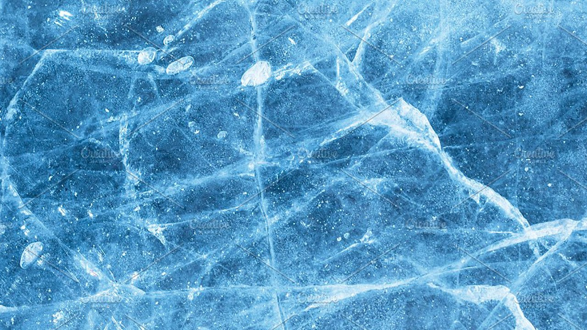

### Матрица Харалика

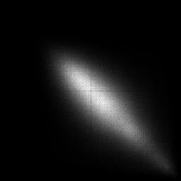

asm: 8.463707412744162e-05

mpr: 0.00019072751371040263

ent: 13.946827484645546

tr: 0.016705793124720147

### Исходное изображение

### Матрица Харалика

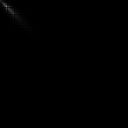

asm: 0.0018647435601625057

mpr: 0.0113439978730004

ent: 10.6073454226018

tr: 0.23405858111401598

### Исходное изображение

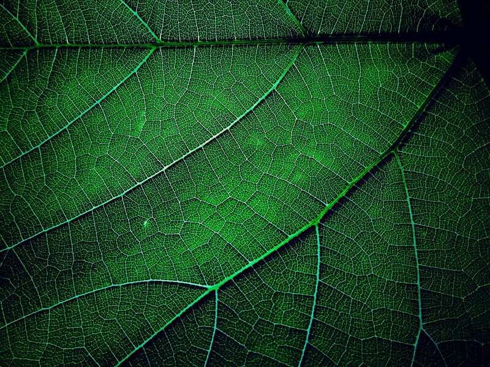

### Матрица Харалика

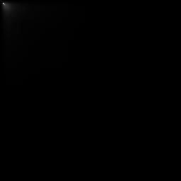

asm: 0.0004444583742011575

mpr: 0.007536726823093002

ent: 12.389811132308791

tr: 0.03476904053934701

### Исходное изображение

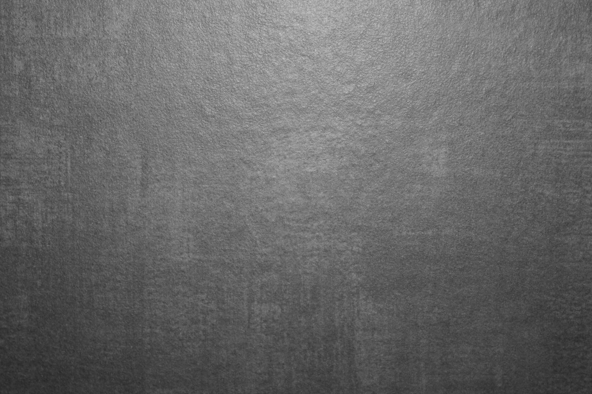

### Матрица Харалика

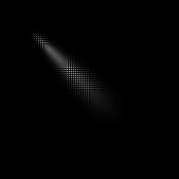

asm: 0.00048347805165932365

mpr: 0.001915264508502727

ent: 11.60222560063669

tr: 0.05296903406327854

### Исходное изображение

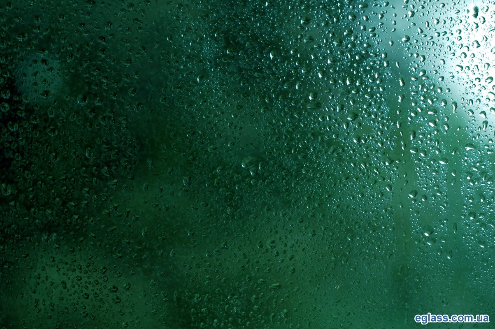

### Матрица Харалика

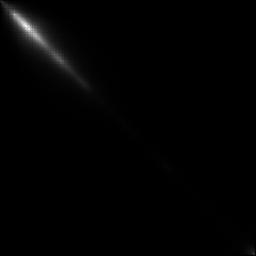

asm: 0.00043708281546806107

mpr: 0.0015311737403703527

ent: 11.94985191413822

tr: 0.057269486578305176

### Исходное изображение

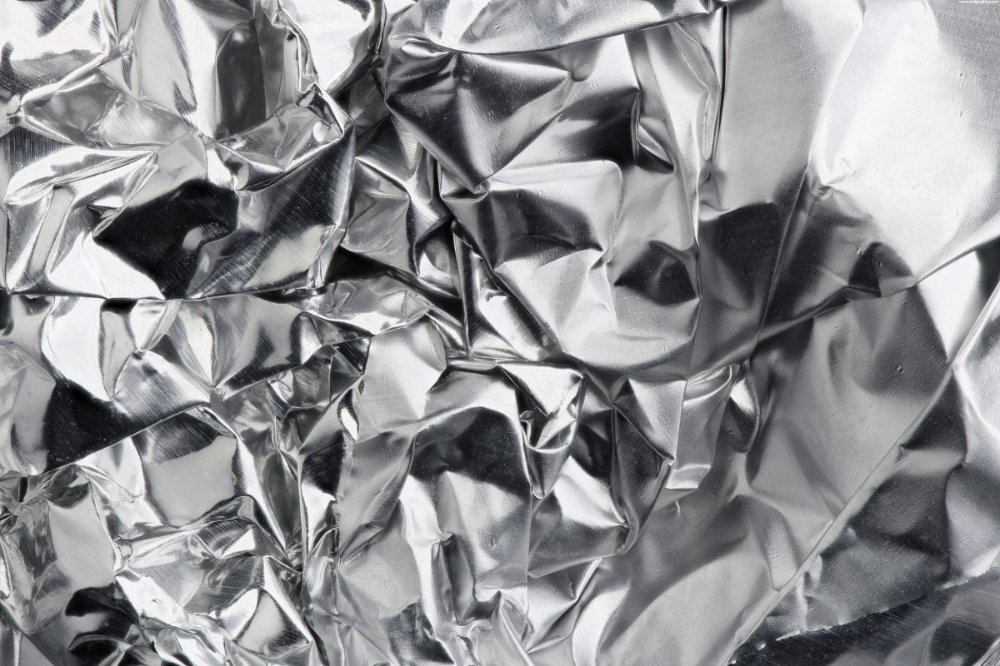

### Матрица Харалика

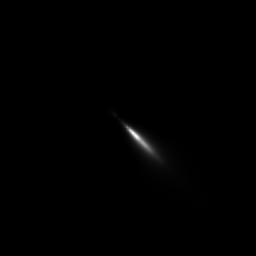

asm: 0.0015054352839482844

mpr: 0.0045031574873788454

ent: 10.288621378180022

tr: 0.09405618392583862

