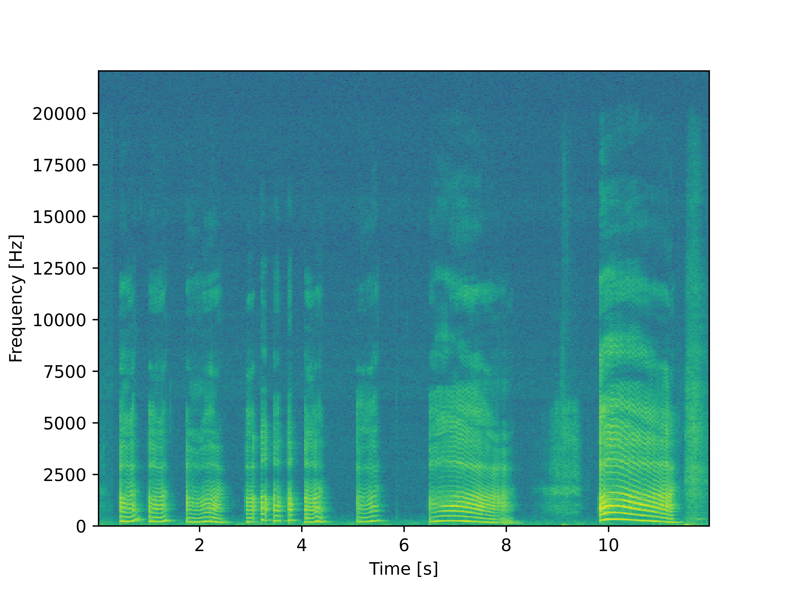

# Лабораторная работа №8

## Тема: Обработка звуковой информации.

|**Студент:**|*Камолов Амир*|
|------------|--------------|
|**Группа:** |*Б18-514*     |
|**Вариант:**|**|

## Спектограмма голоса:

## Спектограмма фортепиано:

